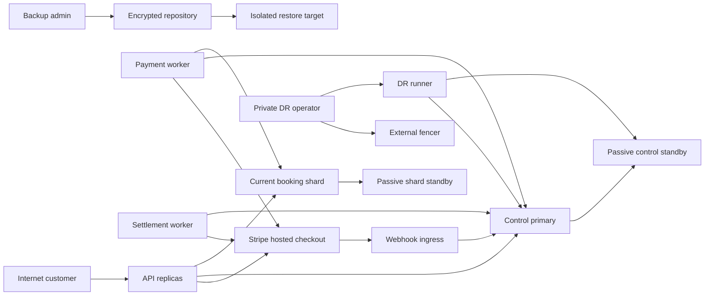

# Scalable Railway Ticketing Platform: Milestone 7 Threat Model

## Executive summary

Milestone 7 adds a production-oriented Stripe adapter, partial-ticket refunds,
an operational financial ledger, settlement evidence, regional failover, and
encrypted restore paths to an existing payment-and-physical-shard system. The
highest risks are duplicate or contradictory provider effects, unauthorized
refund and ledger mutation, and two regions accepting writes after an unsafe
promotion. The existing stable provider-operation identities, durable webhook
inbox, shard-local receipts, and train-run generation fences are valuable
controls, but they do not yet provide the regional epoch, external fencing,
balanced ledger, settlement, or restore protections specified for Milestone 7.

## Scope and assumptions

In scope are `internal/payment/`, `internal/sharding/physical/`,
`internal/sharding/physicalmigration/`, `internal/platform/postgresx/`, the
customer and webhook HTTP routes, payment and settlement workers, operator
CLIs, control and booking-shard migrations, PostgreSQL replication and backup
topology, Compose, CI, and Milestone 7 evidence tooling. The target design is
anchored in `docs/prd/milestone-7-payment-ops-dr.md`; controls named only there
are requirements, not current implementation claims.

Out of scope are raw card collection, live provider credentials or charges in
repository evidence, active-active writes, automatic provider switching,
automatic health-based regional promotion, multi-primary PostgreSQL, PCI
certification, statutory accounting, and production capacity or geographic
failure-domain claims.

Assumptions retained after the context check-in:

- Milestone 7 acceptance uses bounded disposable/test evidence and no live
  financial traffic.
- Customer APIs and provider webhook ingress are Internet reachable; payment,
  settlement, DR, restore, and backup administration remain private.
- One railway operator owns the deployment. Customer accounts are mutually
  untrusted, but this is not an arbitrary SaaS tenant model.
- The active-passive switch is operator-controlled. An independently protected
  external fence succeeds before any database promotion or write enablement.
- Provider test/live, webhook, application, replication, backup-writer,
  restore/decryption, promotion, and audit-reader credentials are distinct.
- PostgreSQL and backup storage hosts are not assumed compromised by an
  ordinary remote customer; privileged-host compromise remains a severe
  deployment risk.

Open questions that would materially change ranking are whether an admin or DR
surface will be Internet exposed, whether untrusted organizations share one
deployment, and whether live Stripe traffic is authorized in this milestone.
Any affirmative answer requires a threat-model refresh before enablement.

## System model

### Primary components

- API replicas authenticate customers, enforce ownership, create hosted
  checkout sessions, and route ticket/refund requests to authoritative data.
- Webhook ingress verifies provider-prescribed raw bytes and commits a
  normalized immutable inbox observation before returning success.
- Payment workers execute durable provider operations and current-shard
  commands. Settlement workers import bounded provider balance and payout
  evidence; settlement reconciliation remains detect-only.
- Control PostgreSQL owns payment, ledger, settlement, regional-authority, DR,
  and global locator state. Two booking PostgreSQL shards own reservations,
  tickets, selected-ticket refund receipts, seat masks, journals, and outboxes.
- The passive region contains read-only streaming standbys. It cannot serve
  customer or worker writes until external fencing, promotion, epoch change,
  pool reset, and reconciliation succeed.
- pgBackRest writes encrypted full/WAL evidence to storage separate from all
  PGDATA volumes. Restore validation uses an allowlisted isolated database.
- Private operator CLIs advance explicit payment repair, settlement review,
  backup, restore, failover, and failback commands. CI builds and scans
  disposable artifacts without production secrets.

### Data flows and trust boundaries

- Internet customer -> API replicas: JWT, idempotency identity, opaque order or
  ticket IDs, and selected ticket IDs over HTTPS. Current JWT role/state refresh
  and owner-scoped payment routes are in `internal/accounts/application/jwt.go`
  and `internal/transport/httpapi/payment.go`; Milestone 7 must reject
  client-supplied money, provider, shard, and card-like fields.
- Browser -> Stripe-hosted Checkout: payment entry occurs on the provider
  origin. The platform receives only bounded hosted-session and provider-object
  references; no PAN or sensitive authentication data returns through the API.
- Stripe -> webhook ingress: raw signed body and provider headers over HTTPS.
  Current size/deadline checks, signature verification, immutable event hash,
  and commit-before-success flow are in `internal/transport/httpapi/payment.go`,
  `internal/payment/provider/httpclient/client.go`, and
  `internal/payment/webhook/`.
- Payment/settlement worker -> Stripe: fixed configured endpoint, scoped
  credential, stable idempotency identity, normalized request and bounded page
  query over HTTPS. Provider I/O remains outside PostgreSQL transactions.
- Runtime -> control/shard PostgreSQL: pgx with process-specific credentials.
  The target implementation must lock and validate region, role, epoch, and
  writes-enabled inside every write transaction; shard writes additionally
  validate generation and the train-run fence.
- Primary PostgreSQL -> passive standby: WAL streaming over a restricted TLS
  replication connection and a dedicated replication identity. Lag and
  timeline facts are observations, not permission to promote.
- Backup writer -> pgBackRest repository: encrypted full/WAL artifacts and
  integrity metadata. Decryption keys do not reside in the database, repository,
  source tree, Compose output, or evidence bundle.
- DR operator -> external fencer and DR admin: private authenticated operator
  action, bounded attestation, explicit confirmation, and append-only audit.
  The fencer credential is distinct from PostgreSQL promotion credentials.
- CI/developer input -> build/evidence artifacts: pull-request code, migrations,
  container definitions, and scripts cross a supply-chain trust boundary.
  Production provider, replication, backup, and promotion secrets are absent.

#### Diagram

## Assets and security objectives

| Asset | Why it matters | Security objective (C/I/A) |
|---|---|---|
| Stripe credentials and provider object IDs | Credential theft or object substitution can create or conceal financial effects | C, I |
| Webhook signing keys and immutable inbox | Forged, lost, or conflicting observations can advance payment state incorrectly | C, I, A |
| Payment operations and idempotency identities | They prevent duplicate capture, void, and refund after ambiguous outcomes | I, A |
| Operational ledger transactions and postings | Balance and event uniqueness support refunds and settlement reconciliation | I, A |
| Settlement and payout evidence | Poisoned or skipped pages can hide missing or duplicated money movement | I, A |
| Customer ownership and selected-ticket set | A refund must affect only tickets owned and deliberately selected by the caller | C, I |
| Reservation, ticket, fare, and seat-mask state | Incorrect release can create financial loss and conflicting travel entitlement | I, A |
| Regional authority and epoch | Exactly one region may authorize customer and worker writes | I, A |
| Fence attestations and DR operation journal | They determine whether promotion and write enablement are lawful and resumable | I, A |
| Replication, backup, restore, and promotion credentials | Cross-duty compromise can expose data or create split brain | C, I, A |
| Encrypted backup/WAL repository and key | Backups contain all customer and financial state and are the last recovery path | C, I, A |
| Audit checkpoints and evidence bundles | Release and incident decisions depend on their authenticity and completeness | I, A |
| Build images, migrations, and workflow definitions | A compromised artifact can bypass all runtime controls | I |

## Attacker model

### Capabilities

- A remote attacker can create or steal an ordinary customer account, submit
  malformed/concurrent requests, choose timing, replay observed events, and
  cause disconnects or bounded dependency pressure.
- A network or dependency fault can occur immediately before or after a
  provider, control, shard, archive, or promotion effect commits. Such faults
  are modeled even without a malicious actor.
- A compromised provider delivery channel can send correctly formed but
  delayed, duplicated, reordered, or semantically contradictory observations;
  signature possession is separately considered.
- A malicious contributor can alter Go, SQL, Compose, PowerShell, workflow, or
  dependency inputs subject to repository review and CI controls.
- A stolen narrowly scoped operator, replication, backup, or restore credential
  can exercise exactly that identity's granted operations. Separation of duty
  must prevent one credential from completing the entire abuse path.

### Non-capabilities

- An ordinary customer cannot choose a provider endpoint, amount, currency,
  shard, region, epoch, database DSN, backup path, restore target, or promotion
  phase.
- This model does not grant a remote attacker PostgreSQL superuser, host root,
  the Stripe account, every webhook key, the external-fencer credential, and
  backup decryption key simultaneously.
- The platform never receives raw card or sensitive authentication data, so
  card-parser and card-storage compromise are excluded by design rather than
  treated as implemented defenses.
- Redis, health checks, DNS, and replication lag cannot by themselves grant
  write authority.

## Entry points and attack surfaces

| Surface | How reached | Trust boundary | Notes | Evidence (repo path / symbol) |
|---|---|---|---|---|
| Hosted checkout and payment intent | Customer HTTPS route | Internet -> API -> provider | Owner scoped; server derives money and return references | `internal/transport/httpapi/payment.go`; `internal/payment/application/service.go` |
| Partial-ticket refund | Customer HTTPS route | Internet -> API -> control/shard/provider | New M7 route; accepts ticket IDs only and must derive fare/masks | `docs/prd/milestone-7-payment-ops-dr.md` partial-refund journey |
| Provider webhook | Provider HTTPS POST | Internet -> webhook ingress | Public but authenticated by raw-body signature; commit before 2xx | `internal/transport/httpapi/payment.go`; `internal/payment/webhook/` |
| Provider adapter | Worker outbound HTTPS | Runtime -> Stripe | Fixed endpoint/version, scoped secret, no redirect, bounded body/time | `internal/payment/provider/provider.go`; `internal/payment/provider/httpclient/client.go` |
| Payment worker | Durable claims | Control -> provider/current shard | Unknown mutations require observation before retry | `internal/payment/worker/`; `internal/payment/worker/postgres/` |
| Settlement importer | Scheduled/private worker | Runtime -> provider/control | New M7 surface; bounded pagination and durable cursor | `docs/prd/milestone-7-payment-ops-dr.md` settlement import decision |
| Settlement admin | Private CLI | Operator -> control | Inspect/review only; correction uses normal command or reversal | `docs/prd/milestone-7-payment-ops-dr.md` administration contract |
| Regional write transaction | Runtime pgx | Process -> control/shard | New epoch guard must be impossible to bypass | `internal/sharding/physical/write_tx.go`; target PRD regional-authority module |
| Streaming replication | PostgreSQL TLS | Primary -> passive standby | Dedicated identity and finite WAL retention | Target `docker-compose.dr.yml`; PRD active-passive topology |
| DR admin and promotion | Private CLI | Operator/fencer -> databases | Explicit phases, external attestation, no arbitrary command target | Target `cmd/dr-admin`; PRD resumable DR runner |
| Backup and restore admin | Private CLI | Operator -> repository/isolated target | Exact database/path allowlists and destructive confirmation | Target `cmd/backup-admin`; PRD backup verifier |
| Pool reset and readiness | Internal process | Promoted database -> runtime | Fresh primary/epoch/timeline proof required before writes | `internal/platform/postgresx/pool.go`; `internal/app/readiness.go` |
| CI, images, and evidence runner | Pull request/workflow | Developer -> release artifact | No production secrets; pinned tools and source/artifact binding | `.github/workflows/`; `Dockerfile`; `scripts/` |

## Top abuse paths

1. **Duplicate a financial mutation:** force a mutating provider 5xx after the
   request commits -> adapter marks it merely retryable -> worker sends a
   second POST -> customer is captured or refunded twice.
2. **Advance from contradictory evidence:** cause an uncertain query to return
   `captured` or `refunded` with wrong cumulative totals -> worker trusts the
   status enum -> issues tickets or releases seats without exact money proof.
3. **Take over webhook rotation:** exploit an unbounded or inconsistent
   old/new-key overlap -> replay an event under a retired regional key or cause
   valid delivery loss -> forge progress or strand an authorized payment.
4. **Refund another customer's ticket:** submit mixed-owner ticket IDs or alter
   the selected set during retry -> platform derives money from an incomplete
   snapshot -> refunds or releases travel rights not owned by the caller.
5. **Poison the financial ledger:** replay one capture/refund/settlement event
   under a changed posting set -> create an unbalanced or duplicate financial
   fact -> conceal settlement mismatch or authorize excess refund.
6. **Skip or rewrite settlement pages:** compromise a provider-report credential
   or cursor update -> advance the checkpoint without the same page commit ->
   hide a payout gap or double import one effect.
7. **Create split brain:** isolate region A without fencing it -> promote region
   B from a lagging standby -> both local authority rows report writable -> two
   control/shard histories accept payments and ticket mutations.
8. **Forge or replay a fence attestation:** submit a stale incident/epoch proof
   to a resumable DR operation -> skip a phase or enable writes before every
   required database and worker is reconciled.
9. **Reuse stale database pools:** switch routing but retain an idle connection
   to the old primary -> a process passes superficial readiness -> old-epoch
   financial or seat mutations commit after promotion.
10. **Turn recovery into destructive restore:** use a compromised backup-admin
    identity to select an active PGDATA path or wrong repository -> overwrite
    authority, leak customer data, or validate an attacker-supplied snapshot.
11. **Strand a paid hold after webhook loss:** authorize at the provider but
    drop the webhook -> omit `awaiting_customer` from recovery candidates ->
    leave payment and inventory pending forever or exhaust a shared attempt
    budget before the first issuance retry.
12. **Exfiltrate through an ambient proxy:** alter a worker's proxy environment
    or return an untrusted hosted URL -> forward the provider bearer credential
    or customer to an attacker-controlled origin.
13. **Fail back onto divergent history:** restart the recovered old primary,
    treat `pg_isready` as freshness proof, and promote its stale timeline ->
    overwrite or fork payments, tickets, refunds, and regional authority created
    after the original failover.

## Threat model table

| Threat ID | Threat source | Prerequisites | Threat action | Impact | Impacted assets | Existing controls (evidence) | Gaps | Recommended mitigations | Detection ideas | Likelihood | Impact severity | Priority |
|---|---|---|---|---|---|---|---|---|---|---|---|---|
| TM-072 | Remote caller or unsafe provider integration | Platform accepts card-like fields or merchant-hosted payment inputs | Submit, persist, log, or back up PAN/SAD or unrestricted provider payloads | Sensitive-data exposure and materially expanded compliance scope | Provider secrets, logs, backups, customer data | Current provider metadata denies card/secret-like keys and exposes bounded normalized types (`internal/payment/provider/provider.go`) | Stripe adapter and new DTOs do not yet exist | Use full provider-hosted redirect; strict unknown-field rejection; no DTO/schema/outbox field for PAN/SAD; synthetic sentinel scans across logs, DB, artifacts, and backup restore | `sensitive_input_rejected` by fixed reason; artifact and restored-DB sentinel scans | medium | high | high |
| TM-073 | Remote webhook caller or leaked retiring key | A key is accepted outside its provider/environment/region/grace or rotation differs across replicas | Forge, replay, or suppress authorization/capture/refund observations | Invalid financial transition or indefinitely stranded customer | Webhook keys, inbox, payment saga | Provider-specific raw-body verifier; exactly-one signature match; provider/account/environment binding; durable primary/accepted/retired metadata; grace beginning on primary demotion; per-request durable key-state validation; passive proof/readiness; immutable regional audit and bounded archive; committed duplicate/conflict acknowledgement (`internal/transport/httpapi/payment.go`; `internal/payment/webhook/`; `internal/payment/webhook/postgres/keyring.go`) | The same-host DR probe demonstrates the Stripe-shaped lifecycle but is not independent-region or live-provider rotation evidence | Preserve the bounded two-key model; stage, prove, demote, wait, retire, and replay with an operator-approved provider retry horizon; keep secret material outside metadata/evidence; require current-key passive fencing before ingress promotion; do not apply Stripe freshness rules to unsupported providers | Signature/key-phase failures; keyring readiness; durable lifecycle counts; event hash conflicts; authorization age; key overlap age | low | high | medium |
| TM-074 | Fault timing, provider, or network attacker | A mutating timeout, disconnect, truncated response, or 5xx is treated as definitely uncommitted | Retry capture/void/refund without first observing provider state | Duplicate charge/refund or release under false void | Provider operations, customer funds, tickets | Stable durable operation identity and uncertainty-query path (`internal/payment/worker/worker.go`) | Current 5xx/503 classification is retryable but not uncertain (`internal/payment/provider/httpclient/client.go`) | Finite `definitely_uncommitted` versus `outcome_unknown`; all dispatched mutating 5xx unknown; persist provider object IDs; query before retry; old unknown without identity enters review | Duplicate provider operation ID; POST-after-unknown alert; uncertain age and query-before-retry counters | high | high | high |
| TM-075 | Compromised provider response or implementation defect | Normalized status can contradict amount, currency, captured, or refunded totals | Advance capture/refund from enum alone | Unfunded ticket, over-refund, or premature seat release | Financial observations, ledger, reservation/ticket state | Webhook path already validates several exact fields; money is immutable (`internal/payment/worker/postgres/finalize.go`) | Synchronous/query finalization does not enforce all cumulative totals | One pure observation evaluator for sync, webhook, recovery, reconcile; capture requires exact captured and zero unexplained refund; refund requires exact monotonic total; contradiction enters review before downstream effects | `inconsistent_response` by fixed reason; no-ticket/no-ledger assertion on contradiction | medium | high | high |
| TM-076 | Application defect, compromised runtime role, or malicious migration | Ledger permits duplicate event, mixed currency, imbalance, update/delete, or double reversal | Alter or replay postings | Financial history cannot support refund or settlement decisions | Ledger transactions/postings, reconciliation | M6 operation rows and states are immutable evidence (`migrations/000010_payment_control_plane.up.sql`) | No operational double-entry ledger exists | Append-only transaction interface; typed account allowlist; checked arithmetic; same currency; equal debit/credit; unique event; one reversal; DB deferred checks and immutable guards; insert-only runtime grants | Balance invariant scan; duplicate event and mutation-denial alerts; signed audit checkpoints | medium | high | high |
| TM-077 | Authenticated customer or racing worker | Selected ticket set is mixed-owner, stale, changed on replay, or client prices it | Request partial refund for unauthorized tickets or manipulate the amount/set | Cross-customer loss, excess refund, wrong seat release | Ownership, ticket/fare/mask, refund totals | JWT/owner-scoped payment paths and exact full-refund receipts (`internal/transport/httpapi/payment.go`; `internal/payment/shard/postgres/compensation.go`) | No selected-ticket refund module/schema exists; current compensation releases every seat and cannot safely be filtered | Accept ticket IDs only; authoritative owner and cutoff checks; canonical set fingerprint; server-derived fare/currency; deterministic locks; new prepare/apply receipts bound to exact fare/masks/proof/generation/region/epoch; additive request-scoped schema that does not weaken M6 full-refund uniqueness | Cross-owner denials; set-fingerprint conflicts; refunded sum versus captured; selected mask before/after checks | high | high | high |
| TM-078 | Compromised provider-report credential, replayed page, or parser defect | Import cursor is advanced separately from normalized rows/conflicts | Skip, replace, or double import balance/payout evidence | Hidden payout/fee gap or false reconciliation | Settlement evidence, checkpoints, ledger | Payment provider calls are bounded and outside DB transactions (`internal/payment/worker/types.go`) | Settlement source/importer/detector do not exist | Narrow read-only source seam; bounded pages; row identity plus payload hash; rows/conflicts/cursor in one transaction; poison-row evidence; detect-only comparison to operations and ledger; no booking mutation interface | Page/hash conflicts; cursor gaps; provider totals versus imported totals; oldest unprocessed page | medium | high | high |
| TM-079 | Regional outage, operator error, or network partition | Old region remains write-capable when target is promoted | Allow two control/shard primaries to commit different histories | Systemic double charge, oversell, lost refund, irreconcilable authority | Regional epoch, payment/ledger, seats/tickets | Train-run generation and shard-local fence protect stale routes within one database (`internal/sharding/physical/write_tx.go`) | No regional authority or external fencing implementation; DB epoch alone cannot fence isolation | Externally fence ingress/process/credentials/network first; signed/bound attestation; monotonic regional epoch inside every write transaction; passive/recovery writes disabled; no health-based promotion | Two writable-primary probe; epoch mismatch; old-region connection/write attempts; reconciliation divergence | medium | critical | critical |
| TM-080 | Compromised DR operator or replayed attestation | Promotion command accepts arbitrary target/phase or stale incident proof | Skip phases, promote wrong databases, reuse epoch, or enable customers before reconcile | Split brain or incomplete financial/ticket recovery | Fence proof, DR journal, database roles | Existing physical migration engine demonstrates typed resumable transitions (`internal/sharding/physicalmigration/engine.go`) | No DR operation model, attestation, or authorization exists | Fixed 20-phase runner and database set; explicit confirm; operator role; attestation bound to operation/source/epoch/incident/hash; CAS transitions; every step re-observes role/timeline; write activation last | Audit every transition/actor/hash; duplicate/stale attestation alert; required-database activation count | low | critical | high |
| TM-081 | Credential thief or over-privileged runtime | One identity can read customer data, replicate WAL, decrypt backups, promote, and delete evidence | Pivot across duties and regions | Broad data exfiltration and integrity loss | DB/WAL/backups/keys/audit | Local payment reconciler has a narrow role (`deploy/compose/payment.override.yml`) | Current general Compose identities are broader; M7 identities not provisioned | Separate app, migration, replication, backup writer, restore/decrypt, fence, promotion, settlement, audit roles; exact hostssl and SCRAM/cert; no superuser; key unavailable to repository and app | Privilege matrix tests; denied sensitive-table reads; secret-consumer inventory; unusual promotion/restore access | medium | high | high |
| TM-082 | Malicious operator, compromised backup identity, or corrupt repository | Restore accepts caller path/target or trusts checksum without boot/invariant proof | Restore into active topology or use altered/incomplete backup | Authority overwrite, data disclosure, unusable recovery | Backups, active PGDATA, payment/ledger/tickets | M5/M6 evidence uses project-scoped teardown and source/artifact hashes (`scripts/run-milestone-6-payment-evidence.ps1`) | No backup/restore implementation; database checksum alone is not recovery proof | Exact database/repository/target allowlists; isolated restore volume; encryption key separate; repository verify plus boot/schema/timeline/payment/ledger/settlement invariants; active target hard reject; dual authorization for destructive expiry | Restore target audit; checksum/timeline mismatch; restore-test age; unexpected repository read/delete | low | critical | high |
| TM-083 | Runtime defect during promotion | Pools retain old connections or readiness checks only ping/schema | Commit through an old primary after route switch | Old-epoch state mutation or false readiness | Pool connections, regional authority, availability | Pools are bounded (`internal/platform/postgresx/pool.go`); current readiness checks database/schema (`internal/app/readiness.go`) | No pool reset, `read-write` target selection, role/timeline/epoch verification | Managed pool interface; reset after promotion; fresh connection; verify database identity, `pg_is_in_recovery=false`, timeline, v11/v3, region/epoch; distinguish activation gate from steady degraded routing | Connection endpoint generation without host label; stale-pool rejection count; readiness reason by fixed category | medium | high | high |
| TM-084 | Contributor, operator, or compromised DB owner | Audit rows/evidence can be updated, deleted, reindexed, or published without source binding | Conceal unsafe repair, promotion, mismatch, or secret leak | False release/incident conclusion | Audit records, evidence bundles, CI artifacts | M6 runner binds source state and scans secrets; payment admin requires a privileged DB role and explicit confirmation (`scripts/test-milestone-6-payment-evidence-runner.ps1`; `cmd/payment-admin/main.go`) | DB append-only is not tamper evidence; current admin request does not bind a trusted operator actor; M7 external checkpointing absent | Inject and persist trusted operator identity for review/export/repair; insert-only operational roles; hash chain and monotonic sequence; periodically signed root with key outside DB/app/backup writer; separate append-only/WORM export; complete artifact index and scoped teardown | Chain/root verification; missing sequence; unknown actor; unexpected audit mutation; publication verifier in CI | low | high | medium |
| TM-085 | Remote burst or dependency outage | Public webhook/refund routes, settlement pages, or recovery claims are unbounded | Exhaust DB pools, inbox, worker lanes, WAL, or backup storage | Payment/ticket unavailability and delayed recovery | Pool/WAL/worker/repository capacity | Current body limits, timeouts, batch claims, `SKIP LOCKED`, and bounded pools (`internal/transport/httpapi/payment.go`; `internal/payment/worker/`; `internal/platform/postgresx/pool.go`) | New M7 lanes/slots/archives have no measured caps | Per-surface rate/batch/time/page limits; action-scoped backoff; fair lanes; finite slot WAL retention; repository retention; provider budget; fail-closed readiness on cap; no unbounded fanout | Queue age, pool acquire duration, WAL safe size, archive lag, repository growth, rate-limit reason | high | medium | high |
| TM-086 | Provider delivery loss, dependency outage, or retry-budget defect | Authorization webhook is omitted and recovery excludes `awaiting_customer`, or provider queries and shard actions share one saga attempt counter | Suppress progress or consume retries before issuance begins | Paid/authorized reservation remains stuck, inventory retained, or compensation/manual review starts from unrelated attempts | Payment saga, action attempts, reservation inventory | Provider queries are the intended recovery path and durable saga work uses leases (`internal/payment/reconcile/`; `internal/payment/worker/`) | `awaiting_customer` is absent from candidate SQL; successful query convergence is incomplete; provider and action attempts share `payment_sagas.attempts` | Add stale `awaiting_customer` candidate with stable query-status operation; apply query through the common evaluator/convergence path; create purpose-built action rows with independent identity, lease, backoff, and attempt count; only an action's own classified failures can drive compensation | Awaiting-customer age; provider/local status divergence; action first-attempt versus inherited-count assertion; stranded reservation count | high | high | high |
| TM-087 | Compromised runtime environment, proxy, or provider response | Outbound client honors an attacker-controlled proxy or hosted URL is not origin constrained | Forward bearer credential or redirect customer to attacker origin | Provider credential theft, fraudulent checkout, metadata exposure | Stripe credential, hosted session, customer trust | Production config requires HTTPS and rejects obvious local/private hosts; redirects are disabled (`internal/platform/config/config.go`; `internal/payment/provider/httpclient/client.go`) | Current client uses ambient proxy configuration; Stripe adapter/hosted URL validation is absent | Default to no proxy or an explicit allowlisted proxy policy; re-resolve and validate destination; never forward credentials across host changes; require returned hosted URL to match the pinned Stripe HTTPS origin; secret-consumer tests | Unexpected proxy use; destination-origin mismatch; egress deny; provider credential sentinel | low | high | high |
| TM-088 | Operator error, recovered old host, or compromised failback identity | Old primary is reachable but has diverged from the current active timeline | Skip fresh restore/reseed and promote stale PGDATA | Fork or overwrite post-failover payments, tickets, ledger, and seat state | Database timelines, regional epoch, all authoritative state | PRD requires failback by fresh reseed and newer epoch; existing physical migration requires higher generations (`docs/prd/milestone-7-payment-ops-dr.md`; `internal/sharding/physicalmigration/engine.go`) | No failback implementation or provenance gate exists | Keep old region fenced; destroy/archive divergent PGDATA; restore from current active backup/WAL into empty volumes; verify source system ID/timeline/LSN and reconciliation; catch up; fence current active; promote only under newer epoch; never accept `pg_isready` as freshness | Stale system-ID/timeline rejection; backup provenance mismatch; old-volume reuse sentinel; failback epoch monotonicity | medium | critical | critical |
| TM-089 | Faulty or malicious standby, archive outage, or over-privileged backup operator | Replication slot retains unbounded WAL, replay stops, or one identity can read WAL and delete recovery chain | Exhaust primary disk, exfiltrate WAL, or destroy usable PITR continuity | Primary outage, data exposure, or unrecoverable RPO/RTO | WAL, slots, archive, repository, database availability | Current pools/topology are bounded but no replication exists; target design selects one fixed slot per database | No finite slot retention, slot/WAL alarms, archive-chain proof, or dedicated M7 identities exist | One dedicated TLS `LOGIN REPLICATION` identity per database; source allowlist; finite measured `max_slot_wal_keep_size`; monitor `wal_status`/safe size; reseed on lost slot; separate backup writer, expiry/deletion, restore/decrypt roles; prove complete PITR chain | Slot inactive age; WAL safe bytes; `pg_wal` disk; archive failure; restore target/achieved LSN gap; denied cross-duty actions | medium | high | high |

## Criticality calibration

- **Critical:** a realistic path can create two writable regional authorities or
  a systemic arbitrary financial effect. Examples: unfenced dual primaries,
  stale-primary failback, repeatable arbitrary capture/refund across customers,
  or broad provider plus promotion credential compromise.
- **High:** a path can duplicate or misstate one customer's money, cross
  ownership, corrupt ledger/settlement integrity, release the wrong seat,
  expose full backups, or make recovery destructively unsafe. Examples: blind
  retry after 5xx, selected-ticket refund substitution, or active-target restore.
- **Medium:** a bounded recoverable outage or evidence/audit weakness that
  requires privileged access and does not independently alter authority.
  Examples: webhook rate pressure within caps, delayed settlement import, or a
  missing external audit checkpoint while DB rows remain intact.
- **Low:** rejected malformed input, harmless exact replay, or bounded status
  disclosure with no customer, money, secret, or authority effect.

The most ranking-sensitive assumptions are private operator surfaces, no live
payments, external fencing independent from PostgreSQL, and separated secrets.
Internet-exposed DR administration or live provider enablement can raise
TM-073, TM-074, TM-079, TM-080, TM-081, and TM-082.

## Focus paths for security review

| Path | Why it matters | Related Threat IDs |
|---|---|---|
| `internal/payment/provider/` | Stripe authentication, versioning, unknown outcomes, status normalization, webhooks, capabilities, egress policy | TM-072, TM-073, TM-074, TM-075, TM-087 |
| `internal/payment/webhook/` | Commit-before-2xx, immutable event identity/hash, duplicate/conflict behavior | TM-073, TM-085 |
| `internal/payment/worker/` | Query-before-retry, action attempts, provider/shard I/O ordering | TM-074, TM-075, TM-077, TM-085, TM-086 |
| `internal/payment/worker/postgres/` | Leases, attempt locality, convergence and control finalization | TM-074, TM-075, TM-077, TM-086 |
| `internal/payment/ledger/` | New balanced append/reversal rules and immutable database adapter | TM-076, TM-078, TM-084 |
| `internal/payment/refund/` | New owner/cutoff/set/fare/idempotency and uncertainty module | TM-075, TM-077 |
| `internal/payment/settlement/` | New bounded page import, conflicts, cursors, detect-only mismatch logic | TM-078, TM-085 |
| `internal/payment/shard/postgres/` | Exact selected-ticket mask release and proof-bound receipts | TM-077, TM-079 |
| `internal/transport/httpapi/payment.go` | Public owner-scoped payment, refund, and webhook request validation | TM-072, TM-073, TM-077, TM-085 |
| `internal/regional/authority/` | New transaction-local region/role/epoch write authorization | TM-079, TM-083 |
| `internal/regional/recovery/` | New fence attestation and typed failover/failback transitions | TM-079, TM-080, TM-083, TM-084, TM-088 |
| `internal/regional/protection/` | New pgBackRest allowlists, parsing, restore proof, secret-safe errors | TM-081, TM-082, TM-084, TM-085, TM-088, TM-089 |
| `internal/platform/postgresx/pool.go` | Reset, fresh-primary selection, role/timeline/epoch validation | TM-079, TM-083 |
| `internal/sharding/physical/` | Existing generation fences and all direct write transaction call sites | TM-079, TM-083 |
| `internal/sharding/physicalmigration/` | v3 selected-refund copy/journal/reverse and retained-source proof | TM-077, TM-079 |
| `migrations/000011_payment_ops_dr.*` | Ledger, settlement, regional authority, DR, immutable guards and grants | TM-076, TM-078, TM-079, TM-080, TM-081 |
| `migrations/booking-shard/000003_payment_ops_dr.*` | Regional epoch and partial-refund receipt/mask invariants | TM-077, TM-079 |
| `cmd/dr-admin/` and `cmd/backup-admin/` | Private authority-changing and destructive operator interfaces | TM-080, TM-081, TM-082, TM-084 |
| `docker-compose.dr.yml` and `deploy/` | Region networks, standby/slot/archive/secret/role isolation | TM-079, TM-081, TM-082, TM-085, TM-088, TM-089 |
| `.github/workflows/` and `scripts/` | Source builds, secret-free evidence, failure drills, publication binding | TM-081, TM-082, TM-084 |

## Quality check

- Covered customer payment/refund, hosted checkout, webhook, provider outbound,
  payment worker, settlement import/reconciliation, control/shard writes,
  replication, promotion, backup/restore, readiness, admin, CI, and evidence
  entry points.
- Represented every material Internet, provider, database, regional, operator,
  backup, and supply-chain trust boundary in at least one abuse path and threat.
- Separated current M6 controls from Milestone 7 requirements and separated
  runtime deployment from disposable sandbox, CI, and evidence behavior.
- Recorded the supplied assumptions and the absence of corrective context in
  this stage; the open questions remain explicit.
- Kept raw card handling, live charges, active-active, automatic promotion,
  generic coordination, and production compliance/capacity claims out of scope.
