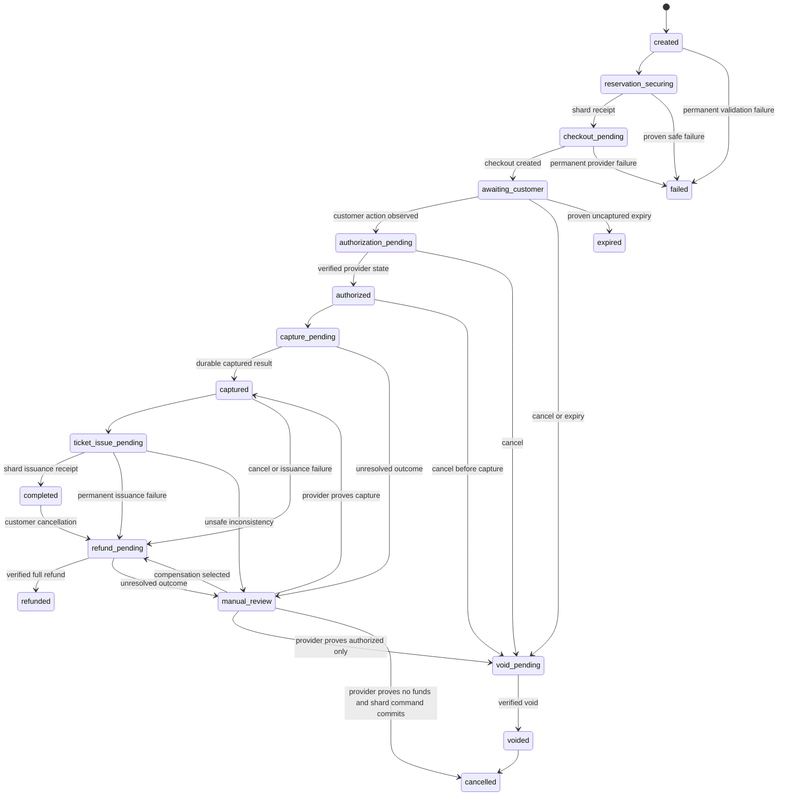

# Payment Intent State Machine

## Control-plane states

`PaymentIntent` uses a constrained state value, not a free-form workflow label:

`created`, `reservation_securing`, `checkout_pending`, `awaiting_customer`,
`authorization_pending`, `authorized`, `capture_pending`, `captured`,
`ticket_issue_pending`, `completed`, `void_pending`, `voided`,
`refund_pending`, `refunded`, `cancelled`, `failed`, `manual_review`, and
`expired`.

Transitions out of `manual_review` require a documented provider query and, if
they affect provider or inventory state, an audited operator-selected command.
`completed`, `refunded`, `voided`, `cancelled`, `failed`, and `expired` do not
regress from stale webhooks. A refund does not make an already issued ticket
cancelled until shard-local compensation commits.

## Saga and operation states

The saga states are `created`, `reservation_secured`, `checkout_created`,
`awaiting_provider`, `authorized`, `capturing`, `captured`,
`issuing_tickets`, `completed`, `compensating`, `refunding`, `compensated`,
`failed`, and `manual_review`.

Operation types are `create_checkout`, `query_status`, `authorize`, `capture`,
`void`, and `refund`. Operation states are `pending`, `claimed`, `in_flight`,
`succeeded`, `failed_retryable`, `failed_permanent`, `uncertain`, and
`cancelled`. A worker can reclaim an expired `claimed`/`in_flight` lease, but it
uses the same operation and idempotency identity. An `uncertain` side effect can
only schedule/query status; it cannot transition directly back to a new side
effect attempt.

## Reservation and ticket states

Physical-shard reservations add `payment_pending`, `payment_review`, and
`refund_pending` to `held`, `confirmed`, `cancelled`, and `expired`.

| From | Allowed destination | Required proof |
|---|---|---|
| `held` | `payment_pending` | unexpired owner-scoped begin-payment receipt with exact money |
| `held` | `expired`, `cancelled` | existing lifecycle policy |
| `payment_pending` | `confirmed` | durable captured snapshot and issuance command |
| `payment_pending` | `payment_review` | unresolved provider outcome/deadline |
| `payment_pending` | `cancelled` | proven no capture or successful void plus local compensation |
| `payment_review` | `payment_pending` | provider proves payable/authorized and workflow resumes |
| `payment_review` | `confirmed` | provider proves capture and issuance commits |
| `payment_review` | `refund_pending` | captured proof and compensation begins |
| `payment_review` | `cancelled` | proven no funds or successful void/refund plus compensation |
| `confirmed` | `refund_pending` | one full-refund cancellation saga |
| `refund_pending` | `cancelled` | durable full refund and local compensation receipt |

`expired -> payment_pending`, `cancelled -> payment_pending`, and
`expired -> confirmed` are invalid. The normal hold expirer only processes
`held`; it never expires `payment_pending`, `payment_review`, or
`refund_pending`. Those states have explicit grace/reconciliation/manual-review
visibility so inventory retention cannot remain silent.

Ticket order states are `payment_pending`, `payment_authorized`,
`payment_captured`, `issuance_pending`, `issued`, `refund_pending`, `refunded`,
`cancelled`, and `manual_review`. Ticket states are `pending`, `active`,
`refund_pending`, and `cancelled`. A refunded/cancelled ticket cannot become
active. Exactly one shard-local transaction activates tickets and confirms the
reservation.

## Money and identity invariants

- Amount and currency are server-derived and immutable after payment begins.
- All amounts use integer minor units; `amount_minor >= 0`.
- Captured amount equals the reservation amount; partial capture is invalid.
- Milestone 6 refunds only the full captured amount and enforces
  `0 <= refunded_amount <= captured_amount`.
- At most one active intent and saga exists per reservation.
- Every transition records a bounded reason/actor category and an audit time.
- An invalid transition returns a bounded domain error and does not mutate any
  state or emit a business event.

## Event ordering

Provider timestamps are evidence, not ordering authority. Exact duplicate
events are no-ops. An event that could regress a state schedules a current
provider query. `completed` cannot regress to `awaiting_customer`; `refunded`
cannot regress to `captured`; `voided` cannot become `captured` unless a
distinct verified capture operation exists. Unknown event types never advance
the intent or saga.
