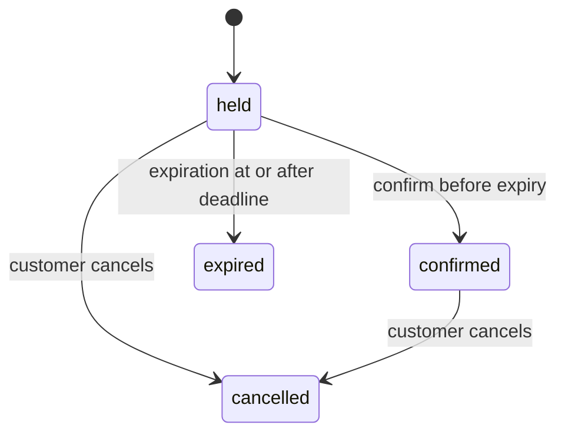

# Reservation State Machine

## States



| State | Blocks seat segments | Customer-visible terminal | Ticket artifacts |
|---|---:|---:|---|
| held | yes | no | none |
| confirmed | yes | no | one confirmed order and active tickets |
| expired | no | yes | none |
| cancelled | no | yes | absent or cancelled |

## Command table

| Current | Confirm | Cancel | Expire |
|---|---|---|---|
| held before expiry | transition to confirmed | transition to cancelled and release | not eligible |
| held at/after expiry | `reservation_expired` | transition to cancelled and release if it wins lock | transition to expired and release |
| confirmed | return stable confirmed result | transition to cancelled and release | invalid; never release |
| expired | invalid | stable terminal conflict | stable expired/no-op |
| cancelled | invalid | stable cancelled/no-op | invalid/no-op |

Repeated command behavior is backed by durable idempotency. A state-aware repeat never emits a duplicate outbox event, creates duplicate tickets, or clears inventory twice.

## Ownership and authorization

- The acting customer is read from a validated access JWT.
- A repository query locks by both reservation ID and owner user ID for customer commands.
- An operator may inspect operational state but cannot impersonate the owner through request fields.
- The hold-expiration worker acts as an internal principal and can only execute the expire transition.

## Transaction and lock order

Every lifecycle command uses one PostgreSQL transaction:

```text
reservation
-> reservation seats ordered by seat_id
-> seat_inventory ordered by seat_id
-> ticket order
-> tickets ordered by id
-> durable idempotency completion
-> outbox insert
```

The reservation row is the serialization point. Status and expiry predicates are rechecked after acquiring its lock.

## Races

### Confirm versus expire

Both lock the reservation. The winner changes `held`; the loser observes `confirmed` or `expired`. Expiration cannot clear a confirmed mask and confirmation cannot revive an expired hold.

### Cancel versus confirm

The winner transitions the locked reservation. If confirmation commits first, a later cancellation is a valid `confirmed -> cancelled` transition and cancels tickets while releasing masks. If cancellation commits first, confirmation fails and creates no ticket artifacts.

### Multiple expiration workers

Batch selection uses `FOR UPDATE SKIP LOCKED`; per-reservation processing rechecks `held` and deadline. One state change creates one release and one event.

### Train-run cancellation versus new hold

The create-hold transaction reads/locks authoritative train-run status before seat mutation. The operator cancellation path follows the same run-before-inventory order. No hold commits after cancellation becomes authoritative.

## Outbox events

| Transition | Event |
|---|---|
| creation into held | `reservation.held` |
| held to confirmed | `reservation.confirmed` and optionally bounded `ticket.created` events |
| held to expired | `reservation.expired` |
| held/confirmed to cancelled | `reservation.cancelled` |

Payment authorization is not present. Confirmation is a simulated successful domain confirmation after validation.
