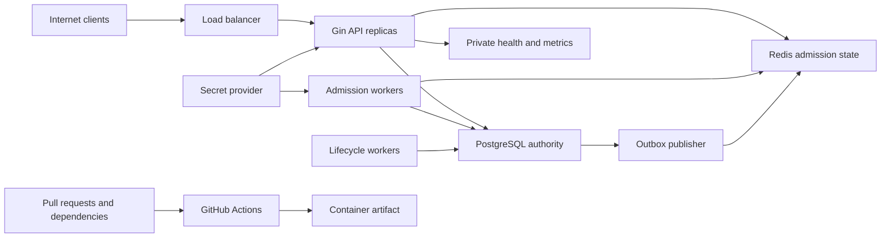

# Security Threat Model

## Executive summary

Milestone 2's highest-risk areas are admission-token theft or rebinding, enabled-policy bypass during Redis or version failure, multi-replica Lua races, durable-quota write skew, Sybil queue/hold abuse, and leakage of token material through delivery, logs, or metrics. PostgreSQL remains the only inventory and durable-booking authority; Redis compromise can deny or reorder admission but must not allocate a seat. The design reduces single-account burst and hold-hoarding risk, but it does not provide complete anti-bot protection, real identity, lossless queue continuity, or multi-region writes.

## Scope and assumptions

In scope: `cmd/`, `internal/`, `migrations/`, `.github/workflows/`, `Dockerfile`, `docker-compose*.yml`, and deployment/configuration documentation. Milestone 2 design evidence is the PRD and ADRs 011-018; implementation controls are not credited until code and tests exist.

Assumptions validated from the project contract:

- The API is Internet-facing behind TLS termination and trusted proxies; PostgreSQL, Redis, worker health, `/metrics`, and detailed readiness are private.
- Customers may self-register. Payment, national identity verification, CAPTCHA, and a complete anti-bot platform remain absent.
- The service is multi-user but not organization-tenanted; JWT subject is the only customer-owner identity.
- API and admission-worker processes receive the same externally managed token-derivation key; it is not stored in Git, PostgreSQL, or Redis.
- Passenger display names and travel associations are sensitive even though government identifiers and payment data are absent.
- PostgreSQL and Redis are single-region private dependencies. Redis uses AOF or equivalent managed persistence but is not assumed lossless.
- PostgreSQL credentials and hosts are not already compromised.
- Resource UUIDs are observable and never treated as authorization.
- Planned controls are not credited as implemented until tests and review point to code/config evidence.

Open deployment questions that affect final ranking: TLS/load-balancer ownership, derivation-key rotation and previous-key retention, Redis backup encryption/restore objectives, monitoring-plane access control, production dependency network policy, and edge-level Sybil/abuse controls.

## System model

### Primary components

- Three stateless Gin API replicas behind one non-sticky HTTP load balancer for public/customer/admin/operator REST endpoints.
- PostgreSQL primary as policy, quota, seat, reservation, ticket, idempotency, and outbox authority.
- Redis for waiting-room/token control-plane state, rate limits, and optional Streams publication; it is never inventory authority.
- Two admission-worker replicas plus hold-expiration and outbox workers using shared internal modules.
- Prometheus/health surfaces for operations.
- GitHub Actions and Docker build producing the runtime image.

### Data flows and trust boundaries

- Internet -> load balancer -> Gin API: credentials, JWTs, queue requests, raw admission tokens, passenger fields, idempotency keys, and booking commands over HTTPS; enforce body limits, strict decoding, normalization, authentication/RBAC/ownership, bounded admission, and safe errors.
- JWT -> application identity: claims cross from an untrusted bearer into authorization; enforce one signing method, type, issuer, audience, time claims, token version, and active user.
- Operator/admin -> policy module -> PostgreSQL: bounded hot-train settings and enable/version changes over authenticated HTTP and parameterized transactions; enforce RBAC, constraints, soft disable, and transactional outbox.
- API/admission worker -> Redis: queue entries, one-time delivery nonce, token hashes/bindings, policy generation, leases, rate windows, and inflight indexes over a private authenticated channel; use exact hash-tagged keys, atomic Lua, Redis `TIME`, bounded TTLs/timeouts, and fail-closed hot-run behavior.
- API/workers -> PostgreSQL: authority-critical policy, quotas, masks, state, PII, and outbox payloads over a pooled TLS-capable database channel; parameterized SQL, least privilege, explicit transactions, deterministic locks, and per-user quota serialization.
- API/admission worker -> secret provider: token-derivation key enters process-owned configuration; require least privilege, rotation/versioning, and no logging or persistence in Redis/PostgreSQL.
- PostgreSQL outbox -> publisher -> log/Redis Stream: minimized typed envelopes; enforce type/size/schema allowlists, bounded retries, poison isolation, and no payload logging.
- Monitoring client -> health/metrics: operational status and bounded labels; restrict network exposure and omit identifiers/secrets.
- Contributor/dependency -> CI -> image: untrusted code and third-party tooling enter the delivery pipeline; immutable pins, read-only permissions, no PR secrets, scanning, and protected release gates.
- Admin/operator token -> privileged routes: topology/fare/run/inventory mutations; explicit role groups, fresh token version, safe audit metadata, and no customer impersonation.

#### Diagram

## Assets and security objectives

| Asset | Why it matters | Security objective (C/I/A) |
|---|---|---|
| Hot-train policy and version | A stale or bypassed enabled decision can flood booking or invalidate legitimate admission | I, A |
| Waiting-room order and inflight/rate state | Corruption creates unfair admission, double issue, or dependency overload | I, A |
| Raw admission tokens and derivation key | Disclosure permits unauthorized booking attempts under a customer's admission | C, I |
| Token hashes, delivery nonces, and bindings | Mutation can deny service or attempt request rebinding; disclosure must not reveal the raw token | C, I, A |
| Seat inventory, reservations, run status, durable quotas | Overselling, stale release, or hold hoarding defeats the core platform | I, A |
| Tickets and ticket orders | Represent travel entitlement and customer travel data | C, I |
| JWT keys, refresh state, password hashes | Compromise permits account/role takeover | C, I |
| Passenger names and ownership links | Customer-isolated personal/travel information | C, I |
| Idempotency records | Prevent duplicate commands and ambiguous retries | I, A |
| Outbox state/payloads | Preserve reliable minimized event delivery | C, I, A |
| Redis limiter/admission state | Abuse resistance and hot-run availability, but never inventory ownership | I, A |
| Logs, errors, health, metrics | Can leak secrets/PII or be cardinality-exhausted | C, A |
| CI credentials, workflow, dependencies, image | Define source and release integrity | C, I |

## Attacker model

### Capabilities

- Remote unauthenticated registration/login/search traffic and arbitrary malformed HTTP input.
- Authenticated customer queue and booking commands, repeated retries, many guessed/observed UUIDs, stolen admission tokens, and potentially many accounts/source addresses.
- Stolen bearer/refresh token replay within its lifetime.
- Concurrency and timing control across join/status/token/create/confirm/cancel endpoints and multiple API replicas.
- Ability to force connection resets and dependency timeouts, but not to choose the outcome of an ambiguous PostgreSQL commit.
- Malicious pull request or compromised third-party dependency/action, subject to repository protections.

### Non-capabilities

- No assumed direct PostgreSQL/Redis host access, server filesystem access, JWT or admission-derivation key, admin/operator credential, or trusted CI environment control. Redis active-write compromise is modeled separately as a privileged dependency breach.
- No payment or national identity system exists to attack.
- Cross-region partitions, active-active writes, payment, and Milestone 3 read caches are outside scope.

## Entry points and attack surfaces

| Surface | How reached | Trust boundary | Notes | Evidence |
|---|---|---|---|---|
| Auth endpoints | Public HTTP | Internet/API, JWT/application | Credential stuffing, token issuance/refresh | `docs/prd/milestone-1-core-ticketing.md` Identity and access |
| Search/availability | Public HTTP | Internet/API, API/PostgreSQL/Redis | Strict query/sort/pagination; cache is hint | ADR 006 |
| Passenger/reservation/ticket APIs | Bearer HTTP | Internet/API, JWT/application | Ownership/IDOR and lifecycle races | ADRs 004, 009 |
| Waiting-room join/status/cancel | Customer bearer HTTP | Internet/API, API/Redis | Queue flood, ownership, duplicate join, one-time delivery | ADR 012 |
| Admission-token reservation gate | Customer bearer HTTP header | Internet/API, API/Redis/Booking | Token theft, MAC validation, binding, retry amplification | ADRs 013, 017 |
| Hot-train policy APIs | Privileged bearer HTTP | JWT/application, application/PostgreSQL/Redis | RBAC, unsafe bounds, generation churn, activation races | ADR 011 |
| Admin/operator APIs | Privileged bearer HTTP | JWT/application | RBAC and operational-state integrity | ADRs 001, 011 |
| PostgreSQL adapters | API/worker calls | Process/database | Dynamic SQL, locks, authority | ADRs 002, 003, 005 |
| Redis admission/Lua adapter | API/worker calls | Process/Redis | Outage/data loss, key injection, forgery, rate/inflight races | ADRs 012, 015, 016 |
| Admission worker | Scheduled loops/processes | Worker/PostgreSQL/Redis | Double issue, lease recovery, key access, per-policy isolation | ADRs 013, 016 |
| Expiration/outbox workers | Scheduled loops/processes | Worker/database/publisher | Duplicate claims, poison events | ADRs 004, 007 |
| `/livez`, `/readyz`, `/metrics` | Operations HTTP | Monitoring plane | Detail/secret/cardinality exposure | PRD Health and metrics |
| CI and Docker | Push/PR/dependency | Contributor/CI/artifact | Supply-chain execution | PRD CI/container requirements |

## Top abuse paths

1. Create many accounts and source identities, fill one hot-policy queue, cancel/rejoin or cycle expired holds, and deny legitimate customers despite per-user deduplication and quotas.
2. Steal a delivered admission token and bearer credential, race first acquire, or substitute route/passengers/idempotency identity; exploit any missing immutable binding to book under another intent.
3. Replay one active `processing` token across API replicas; exploit retry handling that creates many PostgreSQL lock waiters and turns one admission into a database burst.
4. Race policy enable/update/disable against token acquisition or reservation commit; exploit stale Redis generation or a Booking path without a PostgreSQL policy recheck to bypass protection.
5. Delete or restore Redis state, remove the continuity sentinel, and rely on automatic same-generation bootstrap to reset rate/inflight limits while old booking attempts still run.
6. Gain Redis write access, forge queue/token records or reorder admissions, and attempt to make the API accept an issuance record without an application-verifiable MAC.
7. Send concurrent disjoint-passenger reservations for one user; exploit unlocked Read Committed counts or an alternate create path to exceed durable quota.
8. Force API termination or response loss after one-time token delivery or PostgreSQL commit; exploit unsafe lease release/finalization to lose access, strand capacity, or create a duplicate.
9. Place token, nonce, idempotency key, passenger data, or unique IDs into errors, traces, proxy logs, Redis diagnostics, or metric labels to steal credentials or exhaust monitoring.
10. Compromise an action, dependency, derivation-key deployment, or base image to execute in CI/runtime and alter artifacts or admission integrity.

## Threat model table

| Threat ID | Threat source | Prerequisites | Threat action | Impact | Impacted assets | Existing controls (evidence) | Gaps | Recommended mitigations | Detection ideas | Likelihood | Impact severity | Priority |
|---|---|---|---|---|---|---|---|---|---|---|---|---|
| TM-001 | Token thief/remote client | Stolen/malformed JWT | Replay or type/algorithm/claim confusion | Account/role takeover | JWT state, reservations, tickets | Exact HS256/issuer/audience/type/time/version validation; hashed rotating refresh JTI; family revoke on reuse; negative/replay tests | Token theft outside the service remains possible | Rotate signing secrets operationally; alert on refresh-family reuse | Auth failure/reuse counters with bounded reasons | low | high | medium |
| TM-002 | Authenticated customer | Observable foreign UUID | Read/mutate another owner's resource | PII leak or booking corruption | Passenger/reservation/ticket data | Owner-scoped SQL and application commands; mixed-passenger ownership count checks; cross-user negative tests | Operational database superusers remain privileged | Continue owner-scope regression tests and least-privilege database roles | Not-found/forbidden counters | low | high | medium |
| TM-003 | Authenticated customer | Many requests/keys | Key flooding, fingerprint ambiguity, expiry reuse | Storage DoS or duplicate/conflict errors | Idempotency, reservations | Bounded key format, SHA-256 hash, versioned fingerprints, transactionally completed records, database-time expiry reacquisition, reservation rate limit | No scheduled physical purge or durable per-account reservation quota | Monitor expiry index/table size; add cleanup and quotas in an approved later scope | Unique-key creation rate/storage alerts | medium | medium | medium |
| TM-004 | Sybil/automated customers | Cheap accounts or synthetic passenger profiles | Fill queues and cycle admitted holds across accounts/source identities | Hot-run queue and seat availability denial | Queue, inventory availability | M1 TTL/passenger/rate controls; M2 bounded queue, one active entry per user/policy, and PostgreSQL per-user quotas are required by ADRs 012/014 | No real identity, CAPTCHA, device reputation, or complete anti-bot control | Preserve bounded admission/quota controls; add deployment-owned edge abuse controls without claiming Sybil resistance | Queue-full, join/cancel churn, hold/expire ratio, account-creation spikes | high | high | high |
| TM-005 | Remote attacker/dependency failure | Redis outage/latency, data loss, or proxy spoofing | Bypass limits, reset continuity, or deny API work | Admission bypass or hot-run outage | Redis state, service availability | Non-hot endpoint-specific policy in ADR 006; hot-run fail-closed, generation marker, durable initialized version, and AOF requirement in ADRs 011/015 | Recovery objectives and edge ingress controls remain deployment-owned | Enforce noeviction/private Redis, continuity sentinel, operator-opened recovery generation, narrow trusted CIDRs, and edge limiting | Redis failure, missing sentinel, reload/eviction/AOF, recovery-latch alerts | medium | high | high |
| TM-006 | Remote input/internal error | Input reaches diagnostics | Leak password/token/key/PII/payload or explode labels | Confidentiality/monitoring DoS | Secrets, PII, monitoring | Metadata-only structured logs, safe error mapping, private deployment surfaces, finite metric label allowlists, sentinel leakage/cardinality tests | Platform ingress must keep monitoring surfaces private | Enforce NetworkPolicy/ingress exclusions and review new labels | Sentinel leakage and bounded-series tests | low | high | medium |
| TM-007 | Public search client | Dynamic sort/query path | SQL injection or resource-exhausting query | Data compromise or DB outage | PostgreSQL, service | Constant sort allowlists, parameterized values, bounded page size, overflow-safe pagination, indexed query shapes, request/database timeouts | Production query plans depend on real data distribution | Capture slow queries and review plans before scale claims | Invalid-sort/fuzz tests, slow-query metrics | low | high | medium |
| TM-008 | Concurrent customer/operator/worker | Racy commands | Stale/double release, terminal-run reopen, or hold after cancellation | Inventory corruption/oversell | Inventory, reservations, tickets | Authoritative locks/predicates, terminal train-run transition policy, exact release counts, inventory FK, reconciliation including orphan scan, barrier races under `-race` | Chaos/failover and multi-primary behavior are out of scope | Continue reconciliation and race gates; stop affected writes on violations | Reconciliation failures and DB lock/deadlock metrics | low | high | medium |
| TM-009 | Internal defect/privileged writer | Invalid event row | Poison retry loop or payload leak | Event backlog/leak | Outbox, logs, consumers | ADR 007 bounded state/types | Schema/size enforcement unimplemented | Version/type/size constraints; isolate per item; bounded retries; metadata-only logs; durable consumer dedupe | Poison-event integration suite/backlog age | medium | medium | medium |
| TM-010 | Malicious PR/compromised upstream | CI runs third-party code | Exfiltrate token/secrets or alter image | Release compromise | CI, source, artifact | Read-only workflow permissions, SHA-pinned actions, no `pull_request_target`, non-persisted checkout credentials, Actionlint/Gitleaks/Trivy/Govulncheck gates | Registry signing/provenance policy is deployment-owned | Add protected publication, SBOM, signing, and provenance before release distribution | Scanner and fork-PR policy failures | low | high | medium |
| TM-011 | Remote unauthenticated client | Registration and login endpoint access | Compare registration timing or attempt login with an attacker-chosen registration password | Account-existence disclosure and targeted credential attacks | Account identifiers | New and existing valid emails receive the same direct HTTP 202 message; registration does not issue tokens; both endpoints remain rate-limited | Database work can still produce timing differences, and immediate activation permits a follow-up login inference; strict constant-time and email-verification behavior are not claimed | Monitor bounded registration outcomes internally without raw email labels, retain edge abuse controls, and add verified activation in a separately approved identity milestone | Registration/login rate-limit and bounded outcome counters | low | low | low |
| TM-012 | Token thief or Redis writer | Stolen bearer/token pair, or active Redis write access | Race first acquire, rebind request identity, or forge an issuance record | Unauthorized booking attempt or fairness bypass | Admission token, queue integrity, booking availability | JWT ownership; ADRs 013/017 require immutable user/trip/booking/idempotency binding, self-authenticating issuance MAC, SHA-256 storage, and one attempt | Controls remain design-stage until code and theft/race tests exist | Constant-time MAC/hash checks, header-only TLS transport, `no-store`, APM/proxy redaction, active-writer forgery tests | Bounded owner mismatch, MAC invalid, binding conflict, acquire conflict | medium | high | high |
| TM-013 | Customer or compromised operator | Concurrent policy mutation and booking | Exploit disabled-to-enabled race, stale/downgraded Redis generation, or lost update | Bypass admission or invalidate customers repeatedly | Policy integrity, PostgreSQL availability | ADR 011 requires optimistic version, monotonic install, transaction recheck, soft disable, generation invalidation, and audit event | Current Booking transaction has no policy proof/recheck | Add expected-version policy commands, DB recheck before quota/inventory, downgrade barriers, mutation throttling, impact preview | Version mismatch, downgrade, generation churn, actor audit | medium | high | high |
| TM-014 | Dependency failure or privileged Redis actor | Redis restart, restore, eviction, or deletion | Remove queue/rate/inflight state and trigger same-generation recreation | Rate/inflight reset, unfairness, or hot-run outage | Redis continuity, PostgreSQL capacity | ADR 015 requires fail-closed behavior, AOF, durable initialized version, continuity sentinel, and operator-opened generation | Production persistence/restore and drain windows are not yet evidenced | Configure noeviction and durable persistence; never auto-bootstrap previously initialized missing state; rehearse loss with active leases | Missing sentinel/marker, reload/AOF errors, reconciliation deltas | medium | high | high |
| TM-015 | Concurrent customers/workers | Many joins, admissions, cancels, and lease expiries | Exploit check-then-mutate, cross-slot keys, client clocks, or stale lease finalize | Double issue, exceeded limits, or queue corruption | Queue order, inflight/rate bounds | ADRs 012/016 require exact same-slot keys, Redis `TIME`, atomic bounded Lua, monotonic sequence, lease generation, and no `KEYS` | No M2 scripts or multi-worker evidence yet | Central key builder, ARGV limits, atomic scripts, deterministic barriers, three-worker repeat tests, Cluster slot tests | Script reason counters, CROSSSLOT, limit/reconciliation violations | medium | high | high |
| TM-016 | Authenticated customer | Concurrent disjoint-passenger requests or alternate create path | Exploit Read Committed count write skew or omit quota | Exceed durable holds and deny inventory | Reservations, durable quotas, inventory availability | ADR 014 selects per-user advisory transaction lock plus authoritative held counts after idempotency replay and before allocation | No current quota lock/count/index | Keep quota inside Booking transaction; overflow-safe counts; partial indexes; concurrent tests and read-only reconciliation | Quota rejects and any reconciliation excess | medium | high | high |
| TM-017 | Customer or process failure | Repeated processing token, response loss, ambiguous commit, or policy update after commit | Amplify DB work, strand inflight, hide committed result, or unsafe-release token | Targeted DoS, lost response, or duplicate attempt | Idempotency, reservation, token/inflight state | ADRs 013/017 require lease generation, replay-first durable lookup, one DB owner, at-most-once delivery, idempotent finalize, and one-attempt permanent conflict | Network delivery cannot be exactly once; implementation/crash evidence absent | Only acquired owner enters create; processing retries read durable state; cancel/rejoin lost delivery; test every crash seam | In-progress retries, replay repairs, overdue leases, undelivered expiry, finalize failures | medium | high | high |
| TM-018 | Remote input or observability integration | New headers, Lua args, route IDs, or dependency errors reach telemetry | Exfiltrate token/key/PII or create high-cardinality series | Credential/PII disclosure or monitoring DoS | Tokens, passenger data, logs, metrics | Existing safe errors and finite metrics; PRD prohibits IDs/secrets and permits only bounded labels | M2 routes/reasons and proxy/APM redaction are not implemented | Add finite allowlists, sentinel/cardinality tests, metadata-only errors, private metrics, header redaction | Sentinel leakage scans and bounded-series tests | medium | high | high |

## Criticality calibration

- **Critical**: unauthenticated remote code execution in the API/image; direct auth bypass to admin/operator; deterministic widespread overselling from a public request.
- **High**: cross-customer reservation/ticket access; JWT/admission-key or CI artifact compromise; repeatable inventory corruption; practical hot-run admission bypass or Sybil denial.
- **Medium**: bounded targeted denial, one customer's at-most-once token response loss, isolated poison event, or abuse requiring active private-dependency access.
- **Low**: low-sensitivity metadata leak, noisy easily rate-limited traffic, or a weakness requiring direct trusted-host control with minimal additional impact.

## Focus paths for security review

| Path | Why it matters | Related Threat IDs |
|---|---|---|
| `internal/accounts/**` | Password, JWT, refresh rotation, roles, registration enumeration, passenger ownership | TM-001, TM-002, TM-011 |
| `internal/admission/**` | Policy, queue, key builder, Lua, issuance MAC, token binding, worker and reconciliation | TM-004, TM-005, TM-012, TM-013, TM-014, TM-015, TM-017, TM-018 |
| `internal/booking/**` | Allocation, quota serialization, releases, lifecycle, idempotency, ownership | TM-002, TM-003, TM-004, TM-008, TM-016, TM-017 |
| `internal/app/reservation.go` | Replay-first orchestration, policy gate, local backpressure, commit/finalize classification | TM-012, TM-013, TM-016, TM-017 |
| `internal/transport/httpapi/**` | Header-only token transport, ownership, policy RBAC, Retry-After and safe errors | TM-002, TM-012, TM-013, TM-017, TM-018 |
| `internal/offering/**` | Train-run commissioning/status and safe query inputs | TM-007, TM-008 |
| `internal/query/**` | Sort allowlist, pagination, cache hints | TM-005, TM-007 |
| `internal/eventrelay/**` | Poison isolation, payload handling, claims/finalize | TM-006, TM-009 |
| `internal/platform/config/**` | Derivation keyring, process-owned settings, bounds, and secret-free defaults | TM-012, TM-014, TM-017 |
| `internal/platform/middleware/**` | Proxy trust, request limits, auth, header redaction, logs, errors | TM-001, TM-005, TM-006, TM-012, TM-018 |
| `internal/platform/metrics/**` | Bounded labels and private exposure | TM-006, TM-018 |
| `cmd/admission-worker/**` | Root-context lifecycle, private health, key readiness, bounded passes | TM-014, TM-015, TM-017 |
| `migrations/**` | Policy/quota constraints, outbox types, indexes, least privilege | TM-002, TM-003, TM-008, TM-009, TM-013, TM-016 |
| `docker-compose.multi-replica.yml` | Shared Redis persistence and non-sticky multi-replica topology | TM-005, TM-014, TM-015 |
| `.github/workflows/**` | Permissions, immutable actions, untrusted PR execution | TM-010 |
| `Dockerfile` and `Makefile` | Base/tool pins and artifact hardening | TM-010 |

## Notes on use

- This model was re-evaluated against code, migrations, CI, and container/deployment artifacts before PR approval.
- Every entry point and trust boundary above must have at least one implementation test or review anchor.
- Runtime, CI/dev, and test-only controls must remain clearly separated.
- The explicit non-goals do not erase residual risk. TM-004 remains after Milestone 2 because waiting-room admission and per-user quotas do not prove real identity or Sybil resistance.
- M2 controls are not reported as implemented until code, migration, concurrency, failure, and leakage tests point to current evidence.
