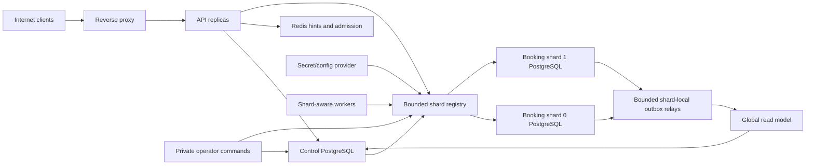

# Security Threat Model

## Executive summary

Milestone 5 introduces a reversible, single-region physical PostgreSQL shard
pilot. Control-plane state remains in `control-postgres`; booking authority is
placed in one of two independently pooled booking databases. The highest new
risks are a poisoned `connection_ref`, stale-router split brain, forged or
replayed booking commands, quota undercount during uncertain outcomes,
incomplete mutation capture, unsafe cutover/reverse migration, and connection
pool exhaustion. PostgreSQL on the selected booking shard remains seat
authority. Redis and route caches are hints and never grant write authority.

This document records the Milestone 5 design controls. A control is not runtime
evidence until its migration, implementation, focused tests, and CI/security
checks pass. The earlier detailed model remains available at
[`security/Scalable-Railway-Ticketing-Platform-threat-model.md`](security/Scalable-Railway-Ticketing-Platform-threat-model.md)
as the Milestone 1-4 baseline.

## Scope and assumptions

In scope are the API, lifecycle and relay workers, shard registry and pools,
control and booking-shard migrations, command coordinator, local booking
executor, shard-local outbox, migration journal, online copy/catch-up/cutover,
reverse migration, operator commands, reconciliation, Compose topology, CI,
and deployment configuration.

Assumptions:

- The pilot is single-region and uses synthetic fixtures; it is not a
  production-capacity or zero-downtime certification.
- PostgreSQL 16 instances and Redis are private dependencies. TLS and
  credential distribution are deployment responsibilities.
- Public HTTP callers cannot provide shard IDs, connection references, DSNs,
  command IDs, migration IDs, or cleanup targets.
- DSNs enter processes only from secrets/configuration. The catalog stores a
  bounded `connection_ref`, never a DSN or password.
- Runtime roles cannot change shard topology, migrations, fences, or cleanup
  state. Operator commands use a separate least-privilege role and remain
  private.
- Existing JWT validation reloads the current database role and token version;
  a stale bearer claim alone does not grant operator authority.
- Passenger names and travel associations are sensitive. The mutation journal,
  telemetry, errors, and operator output contain no passenger PII or secrets.
- A physical booking transaction never queries control PostgreSQL, and a
  control transaction never queries a booking shard. Cross-database outcomes
  converge through durable receipts and reconciliation, not XA/2PC.
- A configured PostgreSQL superuser or compromised secret provider is outside
  the application threat boundary and must be handled by deployment controls.

Open deployment questions that can raise risk are database-role separation,
secret rotation, network policy, operator identity/audit provenance, backup
encryption, monitoring access, and production pool budgets.

## System model

Trust boundaries:

- Internet to API: untrusted identity, booking input, idempotency keys, and
  retry/concurrency patterns.
- API/worker to control PostgreSQL: global command, quota, directory,
  assignment, migration, and read-model authority.
- Registry to secret/config provider: an allowlisted catalog reference becomes
  a trusted endpoint; the catalog value itself is not a connection string.
- API/worker/operator to a booking shard: local snapshots, generation fence,
  command receipts, inventory, bookings, journal, and outbox authority.
- Source to target during migration: copy rows and journal events are untrusted
  at the target until version, scope, sequence, fingerprint, and apply receipt
  validation succeeds.
- Operator and CI boundaries: privileged migration/cleanup controls and build
  inputs must not be reachable from customer HTTP or untrusted pull-request
  secrets.

## Assets and security objectives

| Asset | Objective |
|---|---|
| Connection-reference allowlist and DSNs | Confidentiality, integrity, bounded endpoint selection |
| Shard catalog, assignments, and generations | Exactly zero or one writable shard per train run |
| Local write fences | Reject stale or wrong-database writers before side effects |
| Booking command ledger and fingerprints | Stable retry identity and tamper-evident intent |
| Global quota leases | Conservative enforcement despite uncertain shard outcomes |
| Reservation directory | Repairable global lookup without trusting nonexistent rows |
| Local booking snapshots | Transaction-local cancellation, fare, seat, and ownership validation |
| Inventory, reservations, orders, and tickets | Integrity, availability, customer isolation |
| Shard command receipts and outbox | Durable replay and at-least-once publication without duplicate effects |
| Mutation journal and apply receipts | Complete, ordered, idempotent migration convergence without PII |
| Migration ledger and target-write evidence | Crash recovery, rollback restrictions, retained-source safety |
| Operator audit and cleanup confirmation | Prevent unauthorized or premature destructive actions |
| Pools, logs, metrics, and errors | Availability without secret, topology, PII, or cardinality leakage |

## Attacker model and entry points

Attackers can send malformed/concurrent customer traffic, replay observable
idempotency requests, steal an ordinary bearer token, time dependency failures,
submit a malicious pull request, or exploit a defect in a runtime process. A
compromised Redis instance is modeled as a privileged hint/cache attacker but
cannot grant PostgreSQL write authority. Direct PostgreSQL host control,
secret-provider control, and a trusted operator credential are not assumed;
their misuse is still modeled as a high-impact operational threat.

Entry points are public booking and lookup APIs, JWT parsing, the control
command coordinator, bounded registry/config parsing, local shard executors,
outbox and reconciliation workers, migration/cutover/reverse/cleanup commands,
health/metrics, Compose configuration, GitHub Actions, and container builds.

## Top abuse paths

1. Poison a catalog `connection_ref` or configuration map so a process connects
   to an attacker-selected database and leaks credentials or booking data.
2. Keep an old route in three API replicas and race cutover; exploit any missing
   local fence check to create source/target split brain.
3. Forge a command ID or replay it with a different fingerprint to consume a
   prior receipt, duplicate a mutation, or redirect a reservation.
4. Crash after quota reservation, shard commit, or control finalization; exploit
   an unsafe repair rule to undercount quota or point the directory at no row.
5. Race cancellation, fare change, or seat disable against booking while a
   physical transaction still depends on control-database state.
6. Omit a trigger/mutation path or tamper with journal order, then cut over a
   target missing committed source changes.
7. Replay duplicate/out-of-order journal entries without an atomic target apply
   receipt and create divergent state.
8. Crash between source disable, target enable, and assignment switch; exploit
   ambiguous recovery to enable two writers or discard a valid target.
9. Bypass target-write evidence and use direct rollback after target-era writes,
   losing committed reservations.
10. Misuse cleanup or reverse migration to delete an authoritative source,
    decrease generation, or expose copied passenger data.
11. Exhaust per-shard or total connection pools through one failed shard or
    unbounded admin/worker fanout, starving healthy shards.
12. Compromise Redis route hints, stale JWT claims, logs, metrics, or errors to
    bypass routing/RBAC or disclose DSNs, topology, command IDs, or PII.

## Threat table

| ID | Threat | Required mitigation | Detection and tests | Likelihood | Impact | Priority |
|---|---|---|---|---|---|---|
| TM-038 | Malicious `connection_ref` or DSN injection | Fixed storage kinds; configured allowlist; catalog never stores DSN; reject unknown/duplicate refs; no request-driven connections | Startup-negative tests; bounded `unknown_connection_ref` metric; secret scan | Medium | High | High |
| TM-039 | Catalog poisoning selects the wrong physical shard | Separate catalog writer role; constraints on bounded shard IDs/state/protocol/schema; route includes expected generation | Catalog constraint tests; assignment/reconciliation audit | Medium | High | High |
| TM-040 | Stale router commits to old shard | Every mutation validates expected shard/generation against a database-local enabled fence in the same shard transaction; one bounded refresh | Three-replica barriers; stale-fence reject counter; dual-writer reconciliation | High | Critical | Critical |
| TM-041 | Forged command ID or fingerprint substitution | Server-generated UUID; unique control ledger; canonical request fingerprint checked at control and shard receipt | Same-ID/different-body tests; conflict metric without IDs | Medium | High | High |
| TM-042 | Command replay duplicates inventory mutation | Shard receipt and booking mutation commit atomically; replay returns the durable receipt | 100-request deterministic test; one receipt/reservation/seat mutation | High | High | High |
| TM-043 | Quota lease abandonment undercounts or over-releases | Conservative pending/committed leases; database time; release only after verified shard failure or expiry; reconciliation | Shard outage/ambiguous commit tests; lease-state metrics | Medium | High | High |
| TM-044 | Reservation directory points to no data or wrong owner | Pending/final state machine; shard receipt correlation; authoritative shard owner check; no scanning | Finalization-failure tests; directory/receipt reconciliation | Medium | High | High |
| TM-045 | Forged shard receipt finalizes a command | Receipt keyed by command, route, generation, fingerprint, and result hash; read only from allowlisted selected shard | Mismatch-negative tests; invalid-receipt audit | Low | High | High |
| TM-046 | Snapshot race admits cancelled/invalid booking | Versioned local train-run, fare, seat, and bounded identity snapshots updated as fenced local commands | Deterministic cancel/fare/seat race tests | Medium | High | High |
| TM-047 | Mutation journal omits a write path | Database triggers on every boundary table; same transaction; capture enable/generation guard; rollback tests | Trigger inventory test; per-path mutation and rollback tests | Medium | Critical | Critical |
| TM-048 | Journal tampering, PII, or unbounded payload | Versioned allowlisted operation/table; bounded JSON; no passenger fields/secrets; append-only least-privilege role | Sentinel leakage, size, schema and privilege tests | Medium | High | High |
| TM-049 | Duplicate/out-of-order target application | Per-train-run transactionally allocated sequence; strict next-sequence check; apply receipt in same target transaction | Duplicate/out-of-order/crash replay tests | Medium | High | High |
| TM-050 | Unsafe cutover or crash-window split brain | Ordered source fence, final catch-up/validation, source disable, target enable with newer generation, then control switch; durable checkpoints | Failure hook after every step; assert at most one writer | Medium | Critical | Critical |
| TM-051 | Direct rollback loses target-era writes | Atomic target-write evidence; direct rollback allowed only before evidence; otherwise reverse migration with newer generation | Race test with first target commit; rollback rejection metric | Medium | Critical | Critical |
| TM-052 | Cleanup deletes authoritative/retained data | No automatic cleanup; expired retention window; terminal migration; explicit target-bound confirmation; dry run; revalidation under locks; no cascade | Misuse/interruption tests; rows-selected/deleted audit | Low | Critical | High |
| TM-053 | Reverse migration replays stale/incomplete state | Treat current target as source; new migration ID and higher generation; full copy/journal/validation protocol | Disposable reverse-migration acceptance and reconciliation | Medium | High | High |
| TM-054 | Pool or fanout exhaustion blocks healthy shards | Configured max shard count; per-shard and total pool budget; timeouts; bounded fair enumeration; failure isolation | Pool-budget startup tests; failed-shard and leak tests | High | Medium | High |
| TM-055 | Redis route hint bypasses ownership | PostgreSQL assignment is routing authority; Redis hint never selects a connection or enables a fence | Redis poison/loss tests; hint mismatch metric | Medium | High | High |
| TM-056 | Stale JWT role invokes operator action | Reload current role/token version; private commands; separate DB role; no migration/cleanup HTTP route | Role-change negative tests; operator audit | Low | Critical | High |
| TM-057 | Topology, DSN, command, or PII disclosure | Safe public errors; no DSN formatting/logging; bounded labels; sanitized operator output/journal/outbox | Sentinel scans across logs/errors/artifacts; cardinality tests | Medium | High | High |
| TM-058 | CI or dependency compromises shard credentials | No PR secrets; least permissions; pinned actions/tools; scans; disposable synthetic DBs | Workflow review, gitleaks, dependency/container scans | Low | High | Medium |

## Criticality calibration

- **Critical:** a reachable path can enable two physical writers, lose
  committed target-era booking data, or allow public control of cutover.
- **High:** a defect or authenticated/operational misuse can cross customer or
  shard authority, undercount quota, omit committed migration data, disclose a
  DSN/PII, or delete retained source state.
- **Medium:** a bounded, recoverable outage or topology disclosure that does not
  independently defeat PostgreSQL authority.
- **Low:** rejected input or low-sensitivity metadata with finite cost.

TM-040, TM-047, TM-050, and TM-051 are release blockers until implementation
and deterministic tests exist. TM-038 through TM-058 remain design findings,
not claims of current mitigation, until the associated code and evidence land.

## Focus paths for security review

| Path | Review focus |
|---|---|
| `internal/platform/config/` and the physical registry | Allowlisted references, DSN redaction, bounded pools and endpoints |
| `internal/sharding/` | Route authority, local fencing, migration checkpoints, target-write evidence |
| `internal/booking/` | Control saga, fingerprints, leases, directory, local receipt and snapshot authority |
| `internal/eventrelay/` and shard outbox code | Atomic local outbox, bounded shard enumeration, global event IDs |
| `migrations/000009*` | Control constraints, roles, command/quota/directory/migration invariants |
| `migrations/booking-shard/` | Local fences, receipts, journal triggers, apply receipts, no cross-DB FKs |
| `cmd/shard-admin/`, migration and reconciliation commands | Private authorization, confirmation, safe output, timeouts and resumability |
| `cmd/*worker/` | Fairness, failed-shard isolation, bounded retry and no credential leakage |
| `docker-compose.physical-shards.yml` | Independent data volumes, separate DSNs, private ports and failure injection |
| `.github/workflows/ci.yml` | Disposable databases, no PR secrets, focused security and migration gates |

## Quality check

- All three PostgreSQL trust domains and the configuration-to-DSN boundary are
  represented.
- Public, worker, operator, migration, observability, CI, and dependency entry
  points are covered.
- Runtime baseline controls are distinguished from unimplemented Milestone 5
  requirements.
- Cross-database partial outcomes, journal completeness, every cutover crash
  window, direct rollback, reverse migration, and destructive cleanup are
  explicitly modeled.
- The model makes no active-active, zero-downtime, exactly-once distributed, or
  production-capacity claim.
