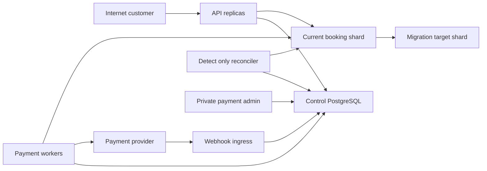

# Milestone 6 Security Threat Model

## Executive summary

Milestone 6 adds a provider-neutral payment saga, signed webhook inbox,
durable ticket issuance, full-refund compensation, and payment-aware physical
shard migration. The dominant risks are accepting a forged or conflicting
provider event, repeating a financial operation after an uncertain response,
issuing duplicate or unfunded tickets, releasing seats before a refund outcome
is known, and omitting payment state during shard migration. The repository
already provides authenticated owner-scoped HTTP routes, bounded request
bodies, hashed idempotency fingerprints, shard-local fences, durable receipts,
outboxes, and mutation journals. Those are evidence-backed foundations, not
proof that the Milestone 6 controls described here are implemented or tested.

## Scope and assumptions

In scope are the implemented payment-intent and ticket APIs, webhook endpoint,
payment provider adapter and deterministic sandbox, control-plane saga and
webhook tables, payment worker and reconciler, physical-shard reservation,
ticket, refund and outbox transitions, migrations 10 and booking-shard 2,
metrics, Compose, CI, and operator tooling. Existing evidence anchors include
`internal/transport/httpapi/`, `internal/accounts/application/jwt.go`,
`internal/booking/domain/`, `internal/sharding/physical/`,
`internal/sharding/physicalmigration/`, migration 9, and booking-shard schema
version 1.

Out of scope are live production-provider enablement, storage or processing of
raw card data, partial capture/refund, chargebacks, multi-region active-active,
XA/2PC, a generic workflow engine, and frontend payment collection.

Assumptions that materially affect ranking:

- Internet clients can call customer APIs and the provider webhook endpoint;
  metrics, worker health, sandbox controls, reconciler mutation mode, and
  `payment-admin` remain private.
- Payment instruments are hosted/tokenized synthetic references. PAN, CVV,
  PIN, magnetic-stripe data, and provider credentials never enter application
  JSON, PostgreSQL, Redis, logs, events, fixtures, or evidence.
- The deterministic sandbox is allowed only in local/test profiles and is
  rejected by production configuration.
- Provider URLs and credentials come only from operator configuration. Public
  input cannot select a URL, redirect target, provider account, shard, or
  connection reference.
- Payment amounts and ISO currency are derived from the authoritative booking
  record, represented as integer minor units, and become immutable when the
  intent is created. Existing `internal/booking/domain/money.go` rejects
  negative values, invalid currency, currency mismatch, and overflow.
- PostgreSQL databases are private. Control and booking-shard transactions
  remain separate; recovery uses durable commands, receipts, queries and
  reconciliation, not XA/2PC.
- Provider-side authorization, capture, void and refund are at-least-once
  requests with stable provider idempotency keys. An unknown response requires
  a provider status query before any retry.

Open deployment questions are the production provider's webhook key-rotation
window, network egress policy, TLS/mTLS requirements, secret-store integration,
operator identity/audit provenance, retention periods, provider rate limits,
and payment-worker/pool budgets. A live provider adapter requires a separate
threat-model refresh and security review.

## System model

### Primary components

- Authenticated API replicas create and read payment intents and ticket state;
  the public webhook route is unauthenticated at HTTP identity level but must
  authenticate the signed raw body before durable acceptance.
- Control PostgreSQL owns payment intents, saga steps, operation idempotency,
  the webhook inbox, provider observations and detect-only reconciliation
  findings.
- Payment workers claim durable work briefly, perform provider I/O outside a
  database transaction, then persist the observed result with compare-and-set
  transitions.
- A configured provider adapter targets only the deterministic local sandbox in
  Milestone 6. The adapter boundary is retained for a future separately gated
  production provider.
- The current physical booking shard owns reservation payment states, payment
  receipts, ticket order/tickets, refund compensation, inventory and local
  outbox effects. Existing route generation and local fence controls are in
  `internal/sharding/physical/` and the version-1 shard schema.
- Migration workers copy and journal shard-local payment and ticket state under
  the existing source-fence, ordered-replay and validation protocol.

### Data flows and trust boundaries

- Internet client -> API replicas: bearer token, reservation/payment-intent
  identifiers, cancellation intent and idempotency key over HTTP. Existing
  authentication/RBAC is in `internal/transport/httpapi/auth.go`; request-body
  limiting is in `internal/transport/httpapi/json.go`.
- Provider/sandbox -> webhook route: raw signed event body, event ID, event
  time, type and provider object identifiers over HTTP. The M6 gate is HMAC
  verification over the exact bounded body, timestamp tolerance, key-ring
  rotation, constant-time comparison, and atomic inbox conflict detection.
- API/workers -> control PostgreSQL: owner, immutable amount/currency, saga
  state, operation receipts, webhook hash and provider observations over pgx.
  Raw idempotency keys and provider secrets must not cross this boundary.
- Payment worker -> provider adapter: stable operation key and tokenized
  synthetic payment reference over bounded HTTP. The endpoint is a configured
  allowlist, redirects are rejected or tightly constrained, and response size
  and duration are bounded.
- API/worker -> current booking shard: reservation state, durable captured
  proof, ticket/refund command and expected route generation over pgx. Existing
  local write-fence and receipt patterns are anchored in
  `migrations/booking-shard/000001_booking_shard.up.sql`.
- Source shard -> target shard: payment reservation fields, receipts, ticket
  state and outbox mutations through bounded copy plus ordered journal replay.
  The target is not trusted until validation and apply receipts succeed.
- Runtime -> observability/operator surfaces: bounded status/reason/provider
  aliases and pool aggregates. IDs, payment references, URLs, DSNs, hosts,
  ports, signatures, keys and request bodies must not become labels or output.

#### Diagram

## Assets and security objectives

| Asset | Why it matters | Security objective (C/I/A) |
|---|---|---|
| Provider credentials and webhook keys | Theft permits forged observations or provider operations | C, I |
| Tokenized payment references | They remain sensitive correlators even though they are not card data | C, I |
| Immutable amount and currency | A mismatch can overcharge, undercharge, or corrupt refund accounting | I |
| Payment intent and saga ledger | It determines which financial operation is permitted next | I, A |
| Provider operation receipts and observations | They prevent blind retries after ambiguous outcomes | I, A |
| Webhook inbox body hash and event identity | They distinguish harmless replay from tampering | I, A |
| Reservation and seat authority | Premature release can resell a seat before compensation is safe | I, A |
| Ticket order and ticket uniqueness | Every paid seat must yield one stable ticket and no duplicate | I, A |
| Refund and compensation ledger | Refunded amount must stay between zero and captured amount | I, A |
| Shard route, fences, journal and apply receipts | Migration must preserve payment and ticket state without two writers | I, A |
| Logs, metrics and evidence | Operational diagnosis must not leak secrets or create unbounded cardinality | C, I, A |
| Build, migration and container artifacts | A compromised artifact can bypass every runtime control | I |

## Attacker model

### Capabilities

- A remote attacker can send malformed, concurrent and replayed customer or
  webhook requests, steal an ordinary customer bearer token, choose request
  timing, and force bounded timeouts or disconnects.
- An attacker may learn a valid webhook event and signature within its replay
  window, collide on an event identifier only by supplying different content,
  or compromise a non-secret provider event delivery channel.
- A malicious contributor may alter application, migration, Compose or CI
  inputs; a compromised worker or sandbox process may send syntactically valid
  but semantically conflicting observations.
- Dependency outages, process crashes, stale shard routes and out-of-order
  delivery are expected fault conditions even without an attacker.

### Non-capabilities

- The model does not assume control of the PostgreSQL host, secret store,
  provider account, trusted operator identity, or release environment. Those
  actors can already subvert authoritative state and require deployment-level
  controls.
- Public callers cannot choose provider endpoints, raw provider idempotency
  keys, database DSNs, shard IDs, assignment generations or migration phases.
- No live cardholder data or live provider exists in Milestone 6. Findings that
  require a future production adapter are conditional and must be reassessed
  before that adapter is enabled.

## Entry points and attack surfaces

| Surface | How reached | Trust boundary | Notes | Evidence (repo path / symbol) |
|---|---|---|---|---|
| Payment-intent create/read/cancel | Internet customer API | Internet -> API | Must be owner-scoped, authenticated, bounded and idempotent | Existing route pattern: `internal/transport/httpapi/reservations.go`; auth: `internal/transport/httpapi/auth.go` |
| Ticket order and ticket reads | Internet customer API | Internet -> API -> shard | Locator is a hint; authoritative shard must verify owner | `internal/app/physical_tickets.go`, `internal/app/tickets.go` |
| Provider webhook | Provider HTTP POST | Internet -> webhook inbox | Authenticate exact raw bounded body before parsing or enqueueing | Planned `/webhooks/payments/:provider`; body-limit pattern: `internal/transport/httpapi/json.go` |
| Provider adapter HTTP client | Worker command | Worker -> configured provider | SSRF, redirect, timeout, response-size and secret boundary | Planned payment provider package; configuration allowlist pattern: `internal/sharding/physical/registry.go` |
| Payment worker | Durable control work | Worker -> control/provider/shard | Claim transaction must be short; provider I/O must occur outside it | Existing `SKIP LOCKED` pattern: `internal/eventrelay/postgres/` and `internal/sharding/physicalworker/` |
| Payment reconciler | Scheduled/private command | Reconciler -> provider/control/shard | Detect-only by default; no direct seat/ticket mutation | Existing detect-only model: `internal/sharding/reconcile/` |
| Payment admin | Private CLI | Operator -> control/provider | Least privilege, dry-run/read defaults and sanitized output | Existing private operator pattern: `cmd/physical-shard-admin/` |
| Booking-shard payment transitions | Routed command | API/worker -> current shard | Expected generation, local fence, receipt and local transaction | `internal/sharding/physical/write_tx.go`, `migrations/booking-shard/000001_booking_shard.up.sql` |
| Online physical migration | Private worker/CLI | Source shard -> target shard | Copy/journal/replay/validate every M6 field and table | `internal/sharding/physicalmigration/`, `migrations/000009_physical_shard_control_plane.up.sql` |
| Health, metrics and logs | Private monitoring/runtime | Runtime -> operators | Bounded labels and redaction; readiness must fail closed on schema/config mismatch | `internal/platform/metrics/`, `internal/platform/safeerror/`, `internal/transport/httpapi/router.go` |
| CI and container build | Pull request/release | Developer input -> artifact | No PR secrets; scan migrations, images and dependencies | `.github/workflows/ci.yml`, `Dockerfile` |

## Top abuse paths

1. **Forge payment success:** send an unsigned, stale, or wrong-key webhook ->
   bypass raw-body verification -> mark an intent captured -> issue a ticket
   without a provider-side capture.
2. **Turn retry into double charge:** force a timeout after provider capture ->
   worker treats the outcome as failure -> retry with a new operation key ->
   provider captures twice.
3. **Exploit event-ID conflict:** replay a valid provider event ID with changed
   content -> overwrite or merge the inbox row -> hide a contradictory amount,
   currency or status -> drive an invalid saga transition.
4. **Pivot through the provider client:** inject or redirect a provider URL ->
   worker sends credentials to an internal/attacker service -> steal secrets or
   consume internal metadata.
5. **Create funded-but-unticketed divergence:** crash after durable capture but
   before ticket issuance/finalization -> unsafe retry creates duplicate tickets
   or permanent failure leaves a paid passenger without a durable order.
6. **Resell before refund certainty:** race customer cancellation, expiry and
   refund timeout -> classify an unknown refund as successful -> release the
   seat -> later observe failed refund and two customers depend on one seat.
7. **Lose payment state at shard cutover:** omit a receipt/status/table from
   base copy or journal replay -> validate only old booking rows -> cut over ->
   repeat capture/refund or lose the durable ticket proof.
8. **Exhaust the saga lane:** submit replay storms or a webhook burst -> hold
   database leases during provider I/O or use unbounded retry/fanout -> starve
   healthy shard and payment work while labels/logs amplify resource use.

## Threat model table

| Threat ID | Threat source | Prerequisites | Threat action | Impact | Impacted assets | Existing controls (evidence) | Gaps | Recommended mitigations | Detection ideas | Likelihood | Impact severity | Priority |
|---|---|---|---|---|---|---|---|---|---|---|---|---|
| TM-059 | Remote client or developer defect | Application accepts payment data beyond a hosted/tokenized reference | Submit or log PAN, CVV, PIN, track data, raw credential or an unrestricted token | Sensitive-data exposure and unsupported compliance scope | Provider credentials, tokenized references, logs/evidence | Existing migrations reject sensitive outbox keys; safe error package exists (`migrations/booking-shard/000001_booking_shard.up.sql`, `internal/platform/safeerror/`) | No M6 payment DTO/schema/log sentinel gates yet | Allowlist payment-reference shape; reject unknown JSON fields and prohibited keys; never persist request body; add repository, log, fixture and artifact sentinel tests | Count bounded `sensitive_input_rejected`; secret scans with synthetic sentinels; alert on prohibited schema columns | medium | high | high |
| TM-060 | Remote webhook caller | Signature, timestamp or key selection is missing or checked after parsing | Forge or replay a captured/cancelled/refunded event | Unfunded issuance, invalid cancellation or false refund | Webhook keys, saga, tickets, refund ledger | Existing HTTP body-limit pattern (`internal/transport/httpapi/json.go`) | No signed webhook inbox yet | Read one bounded raw body; parse strict signature/timestamp; use provider-scoped rotating key ring and constant-time HMAC comparison; reject outside tolerance before JSON parse/persist | Signature failures by bounded reason/provider; replay-window rejects; no body or signature in logs | high | high | high |
| TM-061 | Remote caller or compromised delivery path | Event uniqueness ignores body hash or state transitions trust delivery order | Reuse one event ID with changed content or send valid events out of order | Tamper concealment or saga regression | Webhook inbox, provider observations, payment state | Existing idempotency fingerprints reject changed replay in booking ledgers (`migrations/000009_physical_shard_control_plane.up.sql`) | Provider event conflict/order rules are absent | Unique provider/event ID plus immutable SHA-256 body hash; equal duplicate is harmless; different hash is a security conflict; transitions compare provider object, amount/currency and monotonic semantic state, not arrival order | Conflict audit/alert; duplicate and stale-event counters; reconciliation against provider query | high | high | high |
| TM-062 | Config attacker, redirecting endpoint or malicious provider response | Provider URL/redirect/response is unbounded or secrets reach logs | Trigger SSRF, credential forwarding, slow response or oversized body | Secret theft, internal network access or worker exhaustion | Provider credentials, network, worker capacity | Physical shards already resolve bounded `connection_ref` values instead of request-selected DSNs (`internal/sharding/physical/registry.go`) | M6 provider client boundary is absent | Fixed configured base URLs; reject user URLs and IP-literal/private targets unless explicit local sandbox; production HTTPS; disable redirects or revalidate every hop; bounded dial/TLS/header/body/total timeouts; sanitized errors | Startup rejection; redirect/timeout/body-limit metrics; egress-policy alerts; sentinel secret scans | medium | high | high |
| TM-063 | Fault-timing attacker or dependency outage | Retry uses a new operation identity or unknown outcome is treated as failure | Repeat authorize, capture, void or refund after timeout/disconnect | Double charge/refund or inconsistent provider ledger | Operation receipts, captured/refunded totals, customer funds | Booking commands already use hashed keys, request fingerprints and durable receipts (`migrations/000009_physical_shard_control_plane.up.sql`, `migrations/booking-shard/000001_booking_shard.up.sql`) | No provider operation ledger/query-before-retry proof yet | Derive stable provider idempotency key per saga operation; persist attempt before I/O; classify timeout as unknown; query by provider object/key before retry; reject parameter mismatch; enforce `0 <= refunded <= captured` in integer minor units | Duplicate-provider-object reconciliation; unknown-age and query-before-retry counters; invariant tests under crash barriers | high | high | high |
| TM-064 | Process crash or transient control/shard failure | Cross-database steps are treated as atomic or a finalization receipt is weak | Commit provider/shard side effect then lose control finalization, or finalize against forged/stale receipt | Stuck saga, duplicate work, unfunded/funded mismatch | Intent/saga, shard receipts, tickets | Existing M5 cross-database commands converge via route/generation/fingerprint-bound receipts (`internal/sharding/physicalworker/`, `internal/app/physical_operator_durable.go`) | Payment receipt schemas and recovery are not implemented | Persist deterministic command IDs and fingerprints; bind receipt to intent, operation, amount/currency, shard and generation; make shard replay stable; recovery verifies authoritative receipt before CAS finalization | Unfinalized-command age; receipt mismatch alert; detect-only control/shard reconciliation | medium | high | high |
| TM-065 | Concurrent workers or implementation defect | Ticket issuance is separate from captured proof/receipt or uniqueness is incomplete | Issue twice, issue before capture, or mark issued without every seat ticket | Duplicate/unfunded ticket or paid passenger without travel entitlement | Ticket orders, tickets, captured proof, seats | Current shard schema relates tickets to order and reservation seats and provides local outbox (`migrations/booking-shard/000001_booking_shard.up.sql`) | Current confirmation is not payment-backed; M6 issuance receipt/constraints absent | In one current-shard transaction lock captured proof and reservation; insert one stable order/receipt and one ticket per reservation seat using unique constraints; append local outbox; replay returns same result; finalize control later | Duplicate receipt/code checks; captured-without-issued age; order/seat count mismatch reconciliation | medium | high | high |
| TM-066 | Customer race, provider outage or worker defect | Cancellation/expiry releases inventory while capture/refund outcome is unknown | Release or cancel seats before full refund is durably observed; over-refund on retry | Financial loss and seat oversell/conflicting entitlement | Refund ledger, reservation/tickets, inventory | Hold expiration currently scopes claims to `status = 'held'` (`internal/booking/postgres/expiration_sharding.go`, shard schema partial index) | New payment states and compensation ordering are absent | Expirer touches only held; payment states use `payment_pending`, `payment_review`, `refund_pending`; after capture, permanent issuance failure requests full refund first; release/cancel locally only after durable successful refund; unknown refund retains seat and enters manual review | Refund-pending age; seat released before refund invariant; captured/refunded arithmetic checks | high | high | high |
| TM-067 | Migration defect or malicious operator | Version-2 payment tables/fields are not in copy, capture, replay, validation or reverse migration | Cut over incomplete payment/ticket/refund state or replay an operation twice | Lost ticket, duplicate financial action or unsafe rollback | Shard payment receipts, tickets, refund state, journal | M5 has local fences, ordered mutation journal, apply receipts, validation and reverse migration (`internal/sharding/physicalmigration/`, booking-shard v1) | M6 coverage and version gates are absent | Extend allowlisted table/field set, fingerprints and apply logic; trigger inventory test every M6 mutation; validate counts/checksums/relations and zero lag; require schema v2 before payment routing; block rollback after target-era evidence and use reverse migration | Trigger coverage gate; payment receipt/ticket/refund reconciliation before cutover; stale schema readiness failure | medium | high | high |
| TM-068 | Stolen customer token, stale role or over-privileged operator | Owner/RBAC checks are absent or reconciler/admin can mutate authoritative shard state | Read another customer's payment/ticket data, cancel their intent, or directly repair seats/tickets | Cross-customer disclosure, integrity compromise | Payment/ticket data, operator authority | Existing JWT parsing reloads active role and token version; customer routes use authentication/RBAC (`internal/accounts/application/jwt.go`, `internal/transport/httpapi/auth.go`) | New endpoints, admin privileges and reconciler write boundaries are untested | Authoritative owner checks at control and shard; customer-only mutation routes; private least-privilege admin; reconciler detect-only by default and never directly mutates seats/tickets; audit trusted operator identity | Owner-denial tests; admin/reconciler audit; alert on attempted direct repair or cross-owner lookup | medium | high | high |
| TM-069 | Remote burst, provider outage or one failed shard | Claims are held during network I/O, worksets/retries are unbounded or one shard monopolizes workers | Exhaust connections, goroutines, inbox storage or retry budget and starve healthy work | Payment/ticket availability loss and long repair time | Worker/pool capacity, inbox, saga availability | Existing workers use bounded batches, `SKIP LOCKED`, timeouts and failed-shard isolation patterns (`internal/eventrelay/`, `internal/sharding/physicalworker/`) | M6 worker fairness, leases, backoff and quotas are absent | Short claim/CAS transactions; external I/O outside transaction; expiring leases; capped exponential backoff/jitter; bounded webhook body/rate/storage; fair shard/provider queues; graceful shutdown without leaked leases/connections | Queue depth/age, retry/manual-review counts, provider latency, pgx pool acquired/empty/cancelled/acquire duration by bounded labels | high | medium | high |
| TM-070 | Runtime defect or observability consumer | Secrets, IDs, URLs or unbounded values enter logs/labels/admin output | Exfiltrate payment metadata or create telemetry cardinality denial | Confidentiality loss and monitoring outage | Secrets, references, logs/metrics | Existing safe errors and bounded physical metric normalization (`internal/platform/safeerror/`, `internal/platform/metrics/physical.go`) | M6 redaction/cardinality tests absent | Allow only finite provider/state/result/reason labels and allowlisted `shard_id`; never label IDs, DSNs, host/port, `connection_ref`, request body, signature, token or operation key; sanitize admin output and evidence | Cardinality budget tests; synthetic sentinel scan across logs/artifacts; telemetry scrape size alert | medium | medium | medium |
| TM-071 | Process crash, storage failure, or test-host operator | Sandbox commits a financial effect only in memory, loses stable-key history or an undelivered normalized webhook on restart, or accepts corrupt state | Inject response loss after capture/refund or restart before hosted authorization delivery, then query/replay the original operation | Duplicate synthetic financial effect, contradictory recovery evidence, dropped authorization progress, or stalled saga | Sandbox provider objects, hashed idempotency identities, normalized webhook facts, acceptance evidence | Stable provider keys and query-before-retry are implemented in the worker | Process-local sandbox state and webhook queue did not survive restart | Persist bounded versioned atomic snapshots on a project-scoped volume; hash stored idempotency identities; persist normalized undelivered webhook facts and re-sign them with the active key; reject corrupt/oversized state; fail readiness after save failure; query status and replay only with the original identity | Capture/refund response-loss restart tests; restart-before-authorization-delivery and signing-key-rotation tests; non-root container write/restart probe; full active-saga restart artifact; secret scan | medium | high | high |

## Milestone 6 implementation status

The “gaps” column above records the pre-implementation threat review. The
current source now implements the designed controls: strict payment DTOs and
schema deny boundaries; bounded HMAC/timestamp/key-ID verification before
durable webhook deduplication; immutable event-hash conflicts; a fixed no-
redirect bounded provider client; stable provider operation identities with
query-before-retry uncertainty; fenced payment/issuance/refund/compensation
receipts; schema-v2 migration/reverse coverage; owner-scoped ticket locators;
detect-first reconciliation; operator-gated bounded admin output; and finite
payment metrics. The sandbox remains test-only and production-rejected.

Residual gates are direct runtime, failure, concurrency, secret-scan,
vulnerability, container and CI evidence. A clean source review does not prove
live-provider behavior, PCI certification, settlement correctness, global
cross-shard ticket-code uniqueness, multi-region resilience or production
capacity. The scheduled reconciler remains detect-only and uses SELECT-only
shard credentials plus a control role that can write only checkpoints/manual
reviews in the disposable topology. The private admin wires
the reviewed recorded-command repairer only after operator-role, explicit
confirmation, and exact state/receipt checks; unsupported repairs fail closed.

### Inherited physical-sharding threats

Milestone 6 does not supersede the Milestone 5 register. These threats remain
release gates because every payment command and ticket transition depends on
the same routing, fencing, receipt, migration, pool, and operator controls.

| Threat ID | Threat | Required controls | Verification focus | Likelihood | Impact | Priority |
|---|---|---|---|---|---|---|
| TM-038 | Malicious `connection_ref` or DSN injection | Fixed storage kinds; configured allowlist; catalog never stores DSN; reject unknown or duplicate references | Startup-negative tests; bounded reason metric; secret scan | medium | high | high |
| TM-039 | Catalog poisoning selects the wrong physical shard | Separate catalog writer; bounded shard/state/protocol/schema constraints; expected generation | Catalog constraints; assignment reconciliation | medium | high | high |
| TM-040 | Stale router commits to the old shard | Every mutation validates shard and generation against a database-local enabled fence; one bounded refresh | Three-replica barriers; stale-fence rejection; dual-writer reconciliation | high | critical | critical |
| TM-041 | Forged command ID or fingerprint substitution | Server-generated UUID; unique control ledger; canonical fingerprint checked at control and shard receipt | Same-ID/different-body conflicts | medium | high | high |
| TM-042 | Command replay duplicates inventory mutation | Shard receipt and mutation commit atomically; replay returns the durable receipt | 100-way retry with one mutation | high | high | high |
| TM-043 | Quota lease abandonment undercounts or over-releases | Conservative leases; database time; release only after verified failure or expiry; reconciliation | Ambiguous-commit and outage tests | medium | high | high |
| TM-044 | Reservation directory points to no data or wrong owner | Pending/final directory states; shard receipt correlation; authoritative owner check; no scan | Finalization-failure repair | medium | high | high |
| TM-045 | Forged shard receipt finalizes a command | Receipt binds command, route, generation, fingerprint, and result hash; read only from the allowlisted shard | Receipt mismatch negatives | low | high | high |
| TM-046 | Snapshot race admits cancelled or invalid booking | Versioned local run, fare, seat, and identity snapshots installed as fenced commands | Cancellation/fare/seat race barriers | medium | high | high |
| TM-047 | Mutation journal omits a write path | Triggers cover every authoritative table and share the mutation transaction | Trigger inventory and rollback tests | medium | critical | critical |
| TM-048 | Journal tampering, PII, or unbounded payload | Versioned allowlisted operations/tables; bounded JSON; append-only least privilege; no PII/secrets | Sentinel, size, schema, and privilege tests | medium | high | high |
| TM-049 | Duplicate or out-of-order target application | Strict sequence and target apply receipt in one transaction | Duplicate/order/crash replay | medium | high | high |
| TM-050 | Unsafe cutover or crash-window split brain | Ordered source disable, final catch-up/validation, target enable at newer generation, then control switch | Failure hook after every step; at most one writer | medium | critical | critical |
| TM-051 | Direct rollback loses target-era writes | Durable target-write evidence; direct rollback only before evidence; otherwise reverse migration | First-target-write race | medium | critical | critical |
| TM-052 | Cleanup deletes authoritative or retained data | No automatic cleanup; retention and terminal-state gates; explicit confirmation; dry run; locked revalidation | Misuse and interruption tests | low | critical | high |
| TM-053 | Reverse migration replays stale or incomplete state | Current target becomes source; new migration ID and higher generation; full copy/journal/validation | Reverse acceptance reconciliation | medium | high | high |
| TM-054 | Pool or fanout exhaustion blocks healthy shards | Fixed shard count; per-shard and total pool budgets; timeouts; fair enumeration; failure isolation | Pool budget, pressure, failed-shard, and leak tests | high | medium | high |
| TM-055 | Redis route hint bypasses ownership | PostgreSQL assignment is authority; Redis never selects a connection or enables a fence | Redis poison and loss tests | medium | high | high |
| TM-056 | Stale JWT role invokes an operator action | Reload current role/token version; private commands; separate database role; no migration/cleanup HTTP route | Role-change negatives and operator audit | low | critical | high |
| TM-057 | Topology, command, DSN, or PII disclosure | Safe errors; no DSN formatting/logging; bounded labels; sanitized operator output, journal, and outbox | Sentinel scans and cardinality tests | medium | high | high |
| TM-058 | CI or dependency compromise exposes shard credentials | No PR secrets; least permissions; pinned actions/tools; scans; disposable synthetic databases | Workflow, dependency, secret, and image scans | low | high | medium |

## Criticality calibration

- **Critical:** a remotely reachable path causes systemic unauthorized charges,
  broad provider-key compromise, or widespread issuance without captured funds.
  Examples are a production webhook master-key disclosure, public control of a
  live provider endpoint, or a repeatable bypass that captures arbitrary
  amounts across customers.
- **High:** a realistic remote/fault-timing path can duplicate one financial
  operation, cross customer ownership, issue an unfunded/duplicate ticket,
  release a seat before refund certainty, lose payment state at cutover, or
  disclose a provider credential. TM-059 through TM-069 are high release risks
  until their recommended gates have direct tests and evidence.
- **Medium:** a bounded, recoverable payment-lane outage, delayed manual review,
  or low-volume metadata/cardinality exposure that does not independently alter
  financial or seat authority. TM-070 is medium under private observability.
- **Low:** malformed input rejected before durable work, harmless exact webhook
  replay, or low-sensitivity bounded status disclosure with no owner data.

The rankings assume a synthetic sandbox, private databases/operator surfaces,
and no raw card data. Enabling a live provider, exposing admin/reconciler
mutation, allowing public endpoint selection, or weakening database roles can
raise TM-059, TM-062, TM-063 or TM-068 to critical.

## Focus paths for security review

| Path | Why it matters | Related Threat IDs |
|---|---|---|
| `internal/transport/httpapi/` | Payment/webhook parsing, raw-body limit, ownership, authentication and safe errors enter here | TM-059, TM-060, TM-061, TM-068, TM-069 |
| `internal/payment/provider/` | Provider URL, credential, restart durability, idempotency, timeout, redirect and response boundary | TM-059, TM-062, TM-063, TM-071 |
| `internal/payment/webhook/` | Exact-body HMAC, timestamp/key rotation, event identity/hash conflict and ordering | TM-060, TM-061, TM-069 |
| `internal/payment/application/` | Saga transition graph, unknown outcomes, cancellation and compensation ordering | TM-061, TM-063, TM-064, TM-066 |
| `internal/payment/postgres/` | Control claims, immutable amount/currency, provider observations and receipts | TM-061, TM-063, TM-064, TM-069 |
| Shard-local payment executor | Captured proof, ticket/refund transaction, stable receipt and local outbox | TM-064, TM-065, TM-066, TM-067 |
| `internal/sharding/physical/` | Route/generation/fence and allowlisted connection selection protect every shard effect | TM-062, TM-064, TM-067 |
| `internal/sharding/physicalmigration/` | Copy/journal/replay/validation/reverse must include every M6 state transition | TM-067 |
| `migrations/000010*` | Control constraints, inbox hashes, operation uniqueness, immutable money and least privilege | TM-059 through TM-064, TM-068, TM-069 |
| `migrations/booking-shard/000002*` | Local payment/ticket/refund constraints, receipts, outbox and migration capture coverage | TM-064 through TM-067 |
| `cmd/payment-worker/`, `cmd/payment-reconciler/`, `cmd/payment-admin/` | Lease safety, provider I/O boundaries, detect-only defaults and operator authorization | TM-062 through TM-070 |
| `cmd/payment-sandbox/` and `docker-compose.payment.yml` | Synthetic-only enforcement, restart durability, failure hooks, private ports and secret isolation | TM-059, TM-060, TM-062, TM-071 |
| `internal/platform/metrics/` and `internal/platform/safeerror/` | Secret-free bounded payment and pool observability | TM-070 |
| `.github/workflows/ci.yml` | Migration, security, race, failure-injection and artifact scanning are release gates | TM-059 through TM-070 |

## Quality check

- Covered the discovered customer, webhook, provider-client, worker,
  reconciler, admin, shard, migration, observability, CI and artifact entry
  points.
- Represented Internet/API, provider/webhook, worker/provider,
  runtime/control, runtime/shard, source/target and runtime/operator trust
  boundaries in concrete threats.
- Distinguished implemented M6 controls from source review and evidence gates;
  this document itself is not runtime, security-scan or benchmark proof.
- Kept the deterministic sandbox and CI/dev failure hooks separate from a
  future production provider and production deployment controls.
- Explicitly modeled raw-card-data exclusion, webhook hash conflict,
  out-of-order delivery, stable provider operation identity, unknown outcomes,
  control finalization, ticket issuance, full-refund compensation, migration,
  multi-replica retry and pool/cardinality pressure.
- Open questions and ranking-sensitive deployment assumptions are recorded;
  the supplied Milestone 6 scope resolves the application-level context needed
  for this pre-implementation model.
