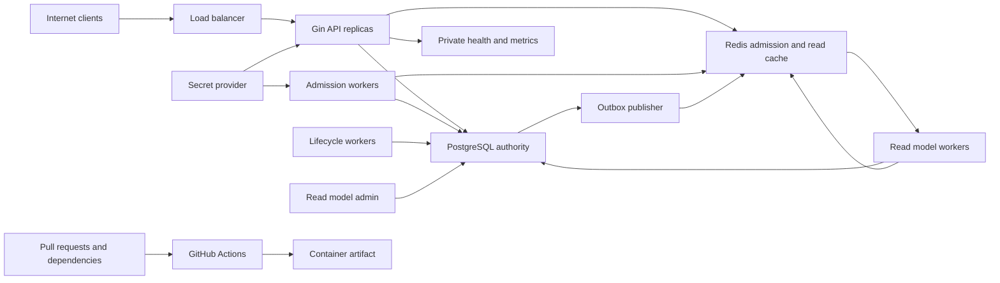

# Security Threat Model

## Executive summary

Milestone 3 adds public cacheable read paths and an event-maintained PostgreSQL
projection to the existing Milestone 2 admission system. Its highest new risks
are cache-key or namespace manipulation, cold-cache amplification against the
PostgreSQL primary, stale availability accidentally crossing into booking
authority, duplicate/out-of-order event corruption, exposed rebuild tooling,
and identifier leakage through cache metrics or logs. PostgreSQL remains the
only inventory and durable-booking authority; Redis compromise can poison or
deny read hints and admission but must never allocate a seat. Existing
admission-token, Sybil, quota, Redis continuity, and supply-chain risks remain.

## Scope and assumptions

In scope: `cmd/`, `internal/`, `migrations/`, `.github/workflows/`, `Dockerfile`,
`docker-compose*.yml`, and deployment/configuration documentation. Milestone 3
design evidence is `docs/prd/milestone-3-read-model-cache.md` and ADRs 019-026.
Milestone 3 implementation evidence now includes migration 7, cache/projection
packages, worker/admin commands, process-scoped manifests, and focused
PostgreSQL/Redis tests. Independent security review and CI scans remain release
gates. Existing Milestone 1/1.1/2 controls retain their evidence.

Assumptions validated from the project contract:

- The API is Internet-facing behind TLS termination and trusted proxies; PostgreSQL, Redis, worker health, `/metrics`, and detailed readiness are private.
- Customers may self-register. Payment, national identity verification, CAPTCHA, and a complete anti-bot platform remain absent.
- The service is multi-user but not organization-tenanted; JWT subject is the only customer-owner identity.
- API and admission-worker processes receive the same externally managed token-derivation key; it is not stored in Git, PostgreSQL, or Redis.
- Passenger display names and travel associations are sensitive even though government identifiers and payment data are absent.
- PostgreSQL and Redis are single-region private dependencies. Redis uses AOF or equivalent managed persistence but is not assumed lossless.
- Public station, search, and availability HTTP reads may reach any API replica;
  they require no sticky session and may be called by unauthenticated clients.
- Journey projections and cache entries are disposable derived data. The
  read-model worker, worker health, metrics, and admin/rebuild commands are
  private operational surfaces with no public ingress.
- Read-cache Redis credentials do not grant PostgreSQL write authority, and the
  read-model worker does not receive JWT or admission-token secrets.
- PostgreSQL credentials and hosts are not already compromised.
- Resource UUIDs are observable and never treated as authorization.
- Planned controls are not credited as implemented until tests and review point to code/config evidence.

Open deployment questions that affect final ranking: TLS/load-balancer
ownership, derivation-key rotation and previous-key retention, Redis backup
encryption/restore objectives, monitoring-plane access control, production
dependency network policy, edge-level Sybil/abuse controls, read-cache memory
limits/eviction policy, and production projection backfill size/lock budget.

## System model

### Primary components

- Three stateless Gin API replicas behind one non-sticky HTTP load balancer for public/customer/admin/operator REST endpoints.
- PostgreSQL primary as policy, quota, seat, reservation, ticket, idempotency, and outbox authority.
- Redis for waiting-room/token control-plane state, rate limits, and optional Streams publication; it is never inventory authority.
- Redis also holds bounded station/search/availability-hint entries and their
  collision-resistant version namespaces; those values are optional read
  accelerators.
- PostgreSQL contains a disposable denormalized journey projection and durable
  read-model event receipts beside authoritative source tables.
- Two admission-worker replicas plus hold-expiration, outbox, and one or two
  read-model workers using shared internal modules.
- A private read-model admin command performs bounded rebuild, lag inspection,
  and detect-only reconciliation.
- Prometheus/health surfaces for operations.
- GitHub Actions and Docker build producing the runtime image.

### Data flows and trust boundaries

- Internet -> load balancer -> Gin API: credentials, JWTs, queue requests, raw admission tokens, passenger fields, idempotency keys, and booking commands over HTTPS; enforce body limits, strict decoding, normalization, authentication/RBAC/ownership, bounded admission, and safe errors.
- JWT -> application identity: claims cross from an untrusted bearer into authorization; enforce one signing method, type, issuer, audience, time claims, token version, active user, and equality with the authoritative database role.
- Operator/admin -> policy module -> PostgreSQL: bounded hot-train settings and enable/version changes over authenticated HTTP and parameterized transactions; enforce RBAC, constraints, soft disable, and transactional outbox.
- API/admission worker -> Redis: queue entries, one-time delivery nonce, token hashes/bindings, policy generation, leases, rate windows, and inflight indexes over a private authenticated channel; use exact hash-tagged keys, atomic Lua, Redis `TIME`, bounded TTLs/timeouts, and fail-closed hot-run behavior.
- API/workers -> PostgreSQL: authority-critical policy, quotas, masks, state, PII, and outbox payloads over a pooled TLS-capable database channel; parameterized SQL, least privilege, explicit transactions, deterministic locks, and per-user quota serialization.
- API/admission worker -> secret provider: token-derivation key enters process-owned configuration; require least privilege, rotation/versioning, and no logging or persistence in Redis/PostgreSQL.
- PostgreSQL outbox -> publisher -> log/Redis Stream: minimized typed envelopes; enforce type/size/schema allowlists, bounded retries, poison isolation, and no payload logging.
- Public read query -> API -> Redis cache: normalized station/search/
  availability inputs cross into exact version/data key lookups; enforce
  allowlisted sort, stable SHA-256 query hashing, server-generated token/key
  components, bounded TTL/jitter/timeouts, and no raw query in keys.
- API -> PostgreSQL projection/source: search reads the projection first and
  falls back to parameterized normalized source SQL; availability always
  computes from authoritative segment masks on miss and remains a hint.
- Redis Stream -> read-model worker -> PostgreSQL/Redis: untrusted-at-the-consumer
  event metadata selects bounded current-state rebuild/invalidation work;
  enforce schema/type allowlists, durable receipts, current-source reload,
  bounded retry/dead letter, and no payload logging.
- Operator shell -> read-model admin -> PostgreSQL/Redis: train-run IDs, batch
  bounds, dry-run, and cursors cross a privileged local process boundary;
  enforce no public HTTP route, least privilege, safe bounded output, and
  detect-only defaults.
- Monitoring client -> health/metrics: operational status and bounded labels; restrict network exposure and omit identifiers/secrets.
- Contributor/dependency -> CI -> image: untrusted code and third-party tooling enter the delivery pipeline; immutable pins, read-only permissions, no PR secrets, scanning, and protected release gates.
- Admin/operator token -> privileged routes: topology/fare/run/inventory mutations; explicit role groups, fresh token version, safe audit metadata, and no customer impersonation.

#### Diagram

## Assets and security objectives

| Asset | Why it matters | Security objective (C/I/A) |
|---|---|---|
| Hot-train policy and version | A stale or bypassed enabled decision can flood booking or invalidate legitimate admission | I, A |
| Waiting-room order and inflight/rate state | Corruption creates unfair admission, double issue, or dependency overload | I, A |
| Raw admission tokens and derivation key | Disclosure permits unauthorized booking attempts under a customer's admission | C, I |
| Token hashes, delivery nonces, and bindings | Mutation can deny service or attempt request rebinding; disclosure must not reveal the raw token | C, I, A |
| Seat inventory, reservations, run status, durable quotas | Overselling, stale release, or hold hoarding defeats the core platform | I, A |
| Tickets and ticket orders | Represent travel entitlement and customer travel data | C, I |
| JWT keys, refresh state, password hashes | Compromise permits account/role takeover | C, I |
| Passenger names and ownership links | Customer-isolated personal/travel information | C, I |
| Idempotency records | Prevent duplicate commands and ambiguous retries | I, A |
| Outbox state/payloads | Preserve reliable minimized event delivery | C, I, A |
| Redis limiter/admission state | Abuse resistance and hot-run availability, but never inventory ownership | I, A |
| Journey projection | Search integrity and read availability; corruption must not alter source tables | I, A |
| Read-model event receipts | Duplicate suppression and evidence that projection work committed atomically | I, A |
| Cache version tokens and query hashes | Select the current namespace without leaking arbitrary query data | C, I, A |
| Station/search cache values | Public read integrity and database load reduction; never booking authority | I, A |
| Availability hints | Customer-facing point-in-time counts that must not bypass inventory checks | I, A |
| Logs, errors, health, metrics | Can leak secrets/PII or be cardinality-exhausted | C, A |
| CI credentials, workflow, dependencies, image | Define source and release integrity | C, I |

## Attacker model

### Capabilities

- Remote unauthenticated registration/login/search traffic and arbitrary malformed HTTP input.
- Authenticated customer queue and booking commands, repeated retries, many guessed/observed UUIDs, stolen admission tokens, and potentially many accounts/source addresses.
- Stolen bearer/refresh token replay within its lifetime.
- Concurrency and timing control across join/status/token/create/confirm/cancel endpoints and multiple API replicas.
- Ability to force connection resets and dependency timeouts, but not to choose the outcome of an ambiguous PostgreSQL commit.
- Malicious pull request or compromised third-party dependency/action, subject to repository protections.

### Non-capabilities

- No assumed direct PostgreSQL/Redis host access, server filesystem access, JWT or admission-derivation key, admin/operator credential, or trusted CI environment control. Redis active-write compromise is modeled separately as a privileged dependency breach.
- No payment or national identity system exists to attack.
- Cross-region partitions, active-active writes, regional cache replication,
  payment, and Milestone 4 behavior are outside scope.

## Entry points and attack surfaces

| Surface | How reached | Trust boundary | Notes | Evidence |
|---|---|---|---|---|
| Auth endpoints | Public HTTP | Internet/API, JWT/application | Credential stuffing, token issuance/refresh | `docs/prd/milestone-1-core-ticketing.md` Identity and access |
| Search/availability | Public HTTP | Internet/API, API/PostgreSQL/Redis | Strict query/sort/pagination; cache is hint | ADR 006 |
| Station/search cache lookup | Public HTTP | Internet/API, API/Redis | Canonical hash, exact keys, bounded TTL, local singleflight, database fallback | ADRs 021, 023 |
| Availability-hint cache | Public HTTP | Internet/API, API/Redis/PostgreSQL | Per-run generation, short TTL, no stale-if-error by default, booking ignores hint | ADR 022 |
| Passenger/reservation/ticket APIs | Bearer HTTP | Internet/API, JWT/application | Ownership/IDOR and lifecycle races | ADRs 004, 009 |
| Waiting-room join/status/cancel | Customer bearer HTTP | Internet/API, API/Redis | Queue flood, ownership, duplicate join, one-time delivery | ADR 012 |
| Admission-token reservation gate | Customer bearer HTTP header | Internet/API, API/Redis/Booking | Token theft, MAC validation, binding, retry amplification | ADRs 013, 017 |
| Hot-train policy APIs | Privileged bearer HTTP | JWT/application, application/PostgreSQL/Redis | RBAC, unsafe bounds, generation churn, activation races | ADR 011 |
| Admin/operator APIs | Privileged bearer HTTP | JWT/application | RBAC and operational-state integrity | ADRs 001, 011 |
| PostgreSQL adapters | API/worker calls | Process/database | Dynamic SQL, locks, authority | ADRs 002, 003, 005 |
| Redis admission/Lua adapter | API/worker calls | Process/Redis | Outage/data loss, key injection, forgery, rate/inflight races | ADRs 012, 015, 016 |
| Admission worker | Scheduled loops/processes | Worker/PostgreSQL/Redis | Double issue, lease recovery, key access, per-policy isolation | ADRs 013, 016 |
| Expiration/outbox workers | Scheduled loops/processes | Worker/database/publisher | Duplicate claims, poison events | ADRs 004, 007 |
| Read-model worker | Redis Stream/private process | Stream/worker, worker/PostgreSQL/Redis | Event parsing, durable dedupe, pending recovery, rebuild/invalidation, dead letter | ADRs 020, 024 |
| Read-model admin/reconcile | Operator CLI | Operator/process/database/cache | Bounded identifiers/cursors, dry-run, detect-only default, no public route | ADR 025 |
| `/livez`, `/readyz`, `/metrics` | Operations HTTP | Monitoring plane | Detail/secret/cardinality exposure | PRD Health and metrics |
| CI and Docker | Push/PR/dependency | Contributor/CI/artifact | Supply-chain execution | PRD CI/container requirements |

## Top abuse paths

1. Send many equivalent cold searches across replicas after namespace rotation;
   exploit absent or incorrectly keyed singleflight to multiply the normalized
   source query and exhaust PostgreSQL used by booking.
2. Manipulate query case, whitespace, pagination, or sort inputs to create
   unbounded cache keys, collide semantically different results, inject SQL
   ordering, or produce high-cardinality telemetry.
3. Delete only a cache version key and wait for a predictable numeric version
   to be reused; resurrect an old namespace and serve stale schedule/search data.
4. Poison an availability hint or race reservation events, then exploit any
   booking path that accepts the cached count instead of executing the
   authoritative overlap predicate.
5. Deliver a projection event twice or out of order, or crash between receipt
   and replacement; exploit payload patching or split commits to expose a
   partial/stale journey set.
6. Send malformed/poison Redis Stream entries that retry forever, log full
   payloads, or block later events and increase projection lag.
7. Reach or misuse rebuild/reconcile tooling, request an unbounded rebuild, or
   induce output of DSNs, Redis secrets, event payloads, or operational IDs.
8. Create many accounts and source identities, fill one hot-policy queue, and
   deny legitimate customers despite per-user deduplication and quotas.
9. Steal an admission token and bearer credential, or exploit Redis continuity
   loss/policy races to bypass or amplify enabled hot-train admission.
10. Compromise a dependency, action, deployment secret, or image to alter the
    artifact, projection, cache, admission, or booking behavior.

## Threat model table

| Threat ID | Threat source | Prerequisites | Threat action | Impact | Impacted assets | Existing controls (evidence) | Gaps | Recommended mitigations | Detection ideas | Likelihood | Impact severity | Priority |
|---|---|---|---|---|---|---|---|---|---|---|---|---|
| TM-001 | Token thief/remote client | Stolen/malformed JWT | Replay, type/algorithm/claim confusion, or forged role | Account/role takeover | JWT state, reservations, tickets | Exact HS256/issuer/audience/type/time/version validation; authoritative database-role comparison; required environment-specific single-replica Compose secret and loopback publication; hashed rotating refresh JTI; family revoke on reuse; negative/replay tests | Token theft or signing-key disclosure outside the service remains possible | Rotate signing secrets and token versions operationally; alert on refresh-family reuse | Auth failure/reuse counters with bounded reasons | low | high | medium |
| TM-002 | Authenticated customer | Observable foreign UUID | Read/mutate another owner's resource | PII leak or booking corruption | Passenger/reservation/ticket data | Owner-scoped SQL and application commands; mixed-passenger ownership count checks; cross-user negative tests | Operational database superusers remain privileged | Continue owner-scope regression tests and least-privilege database roles | Not-found/forbidden counters | low | high | medium |
| TM-003 | Authenticated customer | Many requests/keys | Key flooding, fingerprint ambiguity, expiry reuse | Storage DoS or duplicate/conflict errors | Idempotency, reservations | Bounded key format, SHA-256 hash, versioned fingerprints, transactionally completed records, database-time expiry reacquisition, reservation rate limit, and transaction-serialized per-user hold/passenger quotas | No scheduled physical purge of expired idempotency rows | Monitor expiry index/table size and run separately approved bounded retention work | Unique-key creation rate/storage alerts | medium | medium | medium |
| TM-004 | Sybil/automated customers | Cheap accounts or synthetic passenger profiles | Fill queues and cycle admitted holds across accounts/source identities | Hot-run queue and seat availability denial | Queue, inventory availability | Bounded queue and TTL, one active entry per user/policy, global rate/inflight Lua limits, one-attempt tokens, PostgreSQL per-user quotas, and concurrency regressions | No real identity, CAPTCHA, device reputation, or complete anti-bot control; controls are per account and policy, not Sybil-proof | Preserve bounded admission/quota controls; add deployment-owned edge abuse controls without claiming Sybil resistance | Queue-full, join/cancel churn, hold/expire ratio, account-creation spikes | high | high | high |
| TM-005 | Remote attacker/dependency failure | Redis outage/latency, data loss, or proxy spoofing | Bypass limits, reset continuity, or deny API work | Admission bypass or hot-run outage | Redis state, service availability | Non-hot endpoint-specific policy in ADR 006; hot-run fail-closed, generation marker, durable initialized version, and AOF requirement in ADRs 011/015 | Recovery objectives and edge ingress controls remain deployment-owned | Enforce noeviction/private Redis, continuity sentinel, operator-opened recovery generation, narrow trusted CIDRs, and edge limiting | Redis failure, missing sentinel, reload/eviction/AOF, recovery-latch alerts | medium | high | high |
| TM-006 | Remote input/internal error | Input reaches diagnostics | Leak password/token/key/PII/payload or explode labels | Confidentiality/monitoring DoS | Secrets, PII, monitoring | Metadata-only structured logs, safe error mapping, private deployment surfaces, finite metric label allowlists, sentinel leakage/cardinality tests | Platform ingress must keep monitoring surfaces private | Enforce NetworkPolicy/ingress exclusions and review new labels | Sentinel leakage and bounded-series tests | low | high | medium |
| TM-007 | Public search client | Dynamic sort/query path | SQL injection or resource-exhausting query | Data compromise or DB outage | PostgreSQL, service | Constant sort allowlists, parameterized values, bounded page size, overflow-safe pagination, indexed query shapes, request/database timeouts | Production query plans depend on real data distribution | Capture slow queries and review plans before scale claims | Invalid-sort/fuzz tests, slow-query metrics | low | high | medium |
| TM-008 | Concurrent customer/operator/worker | Racy commands | Stale/double release, terminal-run reopen, or hold after cancellation | Inventory corruption/oversell | Inventory, reservations, tickets | Authoritative locks/predicates, terminal train-run transition policy, exact release counts, inventory FK, reconciliation including orphan scan, barrier races under `-race` | Chaos/failover and multi-primary behavior are out of scope | Continue reconciliation and race gates; stop affected writes on violations | Reconciliation failures and DB lock/deadlock metrics | low | high | medium |
| TM-009 | Internal defect/privileged writer | Invalid event row | Poison retry loop or payload leak | Event backlog/leak | Outbox, logs, consumers | ADR 007 bounded state/types | Schema/size enforcement unimplemented | Version/type/size constraints; isolate per item; bounded retries; metadata-only logs; durable consumer dedupe | Poison-event integration suite/backlog age | medium | medium | medium |
| TM-010 | Malicious PR/compromised upstream | CI runs third-party code | Exfiltrate token/secrets or alter image | Release compromise | CI, source, artifact | Read-only workflow permissions, SHA-pinned actions, no `pull_request_target`, non-persisted checkout credentials, Actionlint/Gitleaks/Trivy/Govulncheck gates | Registry signing/provenance policy is deployment-owned | Add protected publication, SBOM, signing, and provenance before release distribution | Scanner and fork-PR policy failures | low | high | medium |
| TM-011 | Remote unauthenticated client | Registration and login endpoint access | Compare registration timing or attempt login with an attacker-chosen registration password | Account-existence disclosure and targeted credential attacks | Account identifiers | New and existing valid emails receive the same direct HTTP 202 message; registration does not issue tokens; both endpoints remain rate-limited | Database work can still produce timing differences, and immediate activation permits a follow-up login inference; strict constant-time and email-verification behavior are not claimed | Monitor bounded registration outcomes internally without raw email labels, retain edge abuse controls, and add verified activation in a separately approved identity milestone | Registration/login rate-limit and bounded outcome counters | low | low | low |
| TM-012 | Token thief or Redis writer | Stolen bearer/token pair, or active Redis write access | Race first acquire, rebind request identity, or forge an issuance record | Unauthorized booking attempt or fairness bypass | Admission token, queue integrity, booking availability | JWT ownership; versioned keyed HMAC over immutable claims; nonce omitted from raw bearer; SHA-256-only lookup; constant-time verification; owner/trip/route/class/count/fingerprint/idempotency binding; one processing owner; theft, mismatch, forged-record, and 100-way acquire tests | A thief holding both the customer's JWT and delivered token can still race the legitimate customer; private Redis write access can deny service | Enforce TLS and header redaction, isolate/rotate the keyring, restrict Redis writers, and alert on bounded MAC/binding conflicts | Bounded owner mismatch, MAC invalid, binding conflict, acquire conflict | low | high | medium |
| TM-013 | Customer or compromised operator | Concurrent policy mutation and booking | Exploit disabled-to-enabled race, stale/downgraded Redis generation, or lost update | Bypass admission or invalidate customers repeatedly | Policy integrity, PostgreSQL availability | Optimistic versions, transaction advisory policy lock, monotonic Redis install, Booking-transaction policy/version recheck before quota/inventory, soft disable, and transactional outbox events | A compromised authorized operator can deliberately churn generations; partial-failure-safe customer impact preview is deferred | Retain RBAC/audit review, bounded worker pages, churn alerts, and detect-only current/previous-generation reconciliation | Version mismatch, downgrade, generation churn, actor audit | low | high | medium |
| TM-014 | Dependency failure or privileged Redis actor | Redis restart, restore, eviction, or deletion | Remove queue/rate/inflight state and trigger same-generation recreation | Rate/inflight reset, unfairness, or hot-run outage | Redis continuity, PostgreSQL capacity | Fail-closed hot paths, continuity sentinel, durable initialized version, refusal to auto-bootstrap a missing initialized generation, bounded previous-generation inspection, AOF-enabled evidence topology, and PostgreSQL-only inventory authority | Production persistence/restore objectives and active-lease recovery rehearsal remain deployment-owned | Configure noeviction/private durable Redis and rehearse encrypted backup/restore and loss with active leases | Missing sentinel/marker, reload/AOF errors, reconciliation deltas | medium | high | high |
| TM-015 | Concurrent customers/workers | Many joins, admissions, cancels, and lease expiries | Exploit check-then-mutate, cross-slot keys, client clocks, or stale lease finalize | Double issue, exceeded limits, or queue corruption | Queue order, inflight/rate bounds | Central same-slot key builder, Redis `TIME`, bounded atomic Lua, monotonic sequence and lease generation, physical terminal cleanup, 1,000-join/three-worker/rate/inflight/100-token concurrency tests, and an isolated multi-replica CI evidence gate | Redis Cluster runtime and sustained production capacity are not established | Retain deterministic concurrency/reconciliation gates and add deployment-specific Cluster and sustained-load evidence before capacity claims | Script reason counters, CROSSSLOT, limit/reconciliation violations | low | high | medium |
| TM-016 | Authenticated customer | Concurrent disjoint-passenger requests or alternate create path | Exploit Read Committed count write skew or omit quota | Exceed durable holds and deny inventory | Reservations, durable quotas, inventory availability | Per-user advisory transaction lock, authoritative held counts inside the create transaction, overflow-safe bounds, partial indexes, 100-way concurrency tests, and read-only quota reconciliation | Per-user quotas do not prevent many-account abuse | Keep every create path inside the same transaction/lock and combine with deployment-owned account abuse controls | Quota rejects and any reconciliation excess | low | high | medium |
| TM-017 | Customer or process failure | Repeated processing token, response loss, ambiguous commit, or policy update after commit | Amplify DB work, strand inflight, hide committed result, or unsafe-release token | Targeted DoS, lost response, or duplicate attempt | Idempotency, reservation, token/inflight state | Random lease owner plus generation, database deadline shorter than lease, replay-first durable lookup, one DB owner, at-most-once delivery, exact original-generation token locator, binding-checked committed-finalize repair, physical cleanup, and cancellation/finalize failure tests | Network delivery remains at-most-once; total Redis loss can erase undelivered tokens and queue position | Preserve cancel/rejoin recovery, bounded expiry, exact locator TTLs, and every crash-seam regression | In-progress retries, replay repairs, overdue leases, undelivered expiry, finalize failures | low | high | medium |
| TM-018 | Remote input or observability integration | New headers, Lua args, route IDs, or dependency errors reach telemetry | Exfiltrate token/key/PII or create high-cardinality series | Credential/PII disclosure or monitoring DoS | Tokens, passenger data, logs, metrics | Safe public errors, metadata-only logs, finite operation/result/reason/class allowlists, sentinel/cardinality tests, and private health/metrics deployment surfaces | Ingress, APM, and crash-report header redaction remain deployment responsibilities | Keep monitoring private and redact `Authorization`, `X-Admission-Token`, and `Idempotency-Key` at every proxy/APM boundary | Sentinel leakage scans and bounded-series tests | low | high | medium |
| TM-019 | Public read client | Arbitrary station/date/class/page/sort query input | Create ambiguous/colliding keys, unsafe ordering, or excessive key cardinality | Wrong search results, SQL injection, Redis/database exhaustion | Search integrity, Redis, PostgreSQL availability | `NormalizeSearch`, station/class validation, constant sort allowlist, parameterized queries, bounded page/limit, and schema-versioned SHA-256 canonical hashing | Unit tests cover equivalents, unsafe sort, key length/components, and bounded metric labels | Keep request/key bounds versioned; monitor miss/source amplification | Cache request/fallback and invalid-input signals without raw-query labels | low | high | medium |
| TM-020 | Dependency failure or Redis writer | Version key eviction/deletion, restore, or cache write access | Reuse/predict a namespace or poison current cached values | Stale/wrong browsing data and targeted read denial | Version tokens, station/search values, read availability | CSPRNG tokens, atomic Lua create/rotate/repair, exact centralized keys, TTL/jitter, decode validation, and no request-path scan | Real Redis tests cover concurrent creation, malformed/version-only loss, rotation, old namespace isolation, and shared replicas | Use private authenticated Redis and reviewed memory/eviction policy; retain source fallback | Invalid-token, version and cache failure metrics without key labels | medium | medium | low |
| TM-021 | Implementation defect or Redis writer | Booking code can observe or trust cached availability | Serve a positive hint after PostgreSQL is full and bypass authoritative overlap/status checks | Invalid reservation or overselling | Seat inventory, reservations, availability hints | Booking ports remain separate from cache types and execute atomic PostgreSQL overlap/status checks; cached values carry observation/source metadata | Tests cover stale-positive conflict, Redis loss, booking independence, and seat reconciliation | Preserve interface separation and reconcile after mixed load/failure tests | Booking conflict and seat reconciliation alerts with bounded labels | low | high | low |
| TM-022 | Malformed/duplicate/out-of-order event or worker crash | At-least-once Redis Stream delivery | Patch stale payload fields, split receipt/rebuild commits, retry forever, or expose partial replacement | Missing/extra journeys, stale invalidation, worker denial | Projection, receipts, stream backlog, cache coherence | Stable receipt consumer, current-state reload, receipt/rebuild transaction, complete replacement, pending-first claim, bounded attempts/DLQ-before-ACK, safe fields only | PostgreSQL/Redis tests cover duplicate/out-of-order, rollback, atomic readers, pending recovery, DLQ, and invalidation retry | Alert on pending age/DLQ and rehearse process termination | Duplicate, lag, rebuild, retry/DLQ, and reconciliation metrics | medium | high | low |
| TM-023 | Public clients or cache outage | Popular key cold/rotated across several replicas | Coordinate identical misses to amplify projection/source work and consume DB pools | Search denial that can contend with authoritative booking | PostgreSQL connections, API/read availability | Exact-key local singleflight, second cache read, TTL jitter, shared Redis, batch availability, and bounded request/database settings | Concurrency tests prove one local fill, independent keys, retry after failure, and cross-replica warm reuse | Measure cross-replica cold amplification before considering a distributed lease | Source/fallback/singleflight counters, DB pool saturation, cold-cache load scenario | medium | medium | medium |
| TM-024 | Compromised operator/process or network misconfiguration | Access to read-model worker health/admin process or over-mounted secrets | Trigger unbounded/destructive rebuild, exfiltrate config, or mutate source tables | Operational denial, secret exposure, source integrity loss | Projection, PostgreSQL, Redis credentials, operational metadata | Worker HTTP exposes private health/metrics only; admin is CLI-only, bounded/cancellable and dry-run by default; manifests mount only DB/Redis settings | Command/config/lifecycle tests and Kustomize/Compose renders cover process scope and bounds | Production overlay must add least-privilege roles, private network policy, and operator audit | Rebuild actor/change audit and deployment/private-surface scans | low | high | medium |

## Criticality calibration

- **Critical**: unauthenticated remote code execution in the API/image; direct auth bypass to admin/operator; deterministic widespread overselling from a public request.
- **High**: cross-customer reservation/ticket access; JWT/admission-key or CI artifact compromise; repeatable inventory corruption; practical hot-run admission bypass or Sybil denial.
- **Medium**: bounded targeted denial, one customer's at-most-once token response loss, isolated poison event, or abuse requiring active private-dependency access.
- **Medium** also includes stale public search output that cannot alter booking,
  bounded duplicate cache rotation, and one worker's recoverable projection lag.
- **Low**: low-sensitivity metadata leak, noisy easily rate-limited traffic, a
  cache miss without source amplification, or a weakness requiring direct
  trusted-host control with minimal additional impact.

## Focus paths for security review

| Path | Why it matters | Related Threat IDs |
|---|---|---|
| `internal/accounts/**` | Password, JWT, refresh rotation, roles, registration enumeration, passenger ownership | TM-001, TM-002, TM-011 |
| `internal/admission/**` | Policy, queue, key builder, Lua, issuance MAC, token binding, worker and reconciliation | TM-004, TM-005, TM-012, TM-013, TM-014, TM-015, TM-017, TM-018 |
| `internal/booking/**` | Allocation, quota serialization, releases, lifecycle, idempotency, ownership | TM-002, TM-003, TM-004, TM-008, TM-016, TM-017 |
| `internal/app/reservation.go` | Replay-first orchestration, policy gate, local backpressure, commit/finalize classification | TM-012, TM-013, TM-016, TM-017 |
| `internal/transport/httpapi/**` | Header-only token transport, ownership, policy RBAC, Retry-After and safe errors | TM-002, TM-012, TM-013, TM-017, TM-018 |
| `internal/offering/**` | Train-run commissioning/status and safe query inputs | TM-007, TM-008 |
| `internal/query/**` | Sort allowlist, pagination, cache hints | TM-005, TM-007 |
| `internal/query/cache/**` | Version-token generation, canonical query hashing, TTL/jitter, exact keys, singleflight, and fallback | TM-019, TM-020, TM-021, TM-023 |
| `internal/query/readmodel/**` | Atomic rebuild, receipts, current-state reload, source fallback, and reconciliation | TM-021, TM-022, TM-024 |
| `internal/eventrelay/**` | Poison isolation, payload handling, claims/finalize | TM-006, TM-009 |
| `internal/platform/config/**` | Derivation keyring, process-owned settings, bounds, and secret-free defaults | TM-012, TM-014, TM-017 |
| `internal/platform/metrics/**` | Bounded labels and private exposure | TM-006, TM-018 |
| `cmd/admission-worker/**` | Root-context lifecycle, private health, key readiness, bounded passes | TM-014, TM-015, TM-017 |
| `cmd/read-model-worker/**` | Stream parsing, pending recovery, retries, DLQ, secret scope, readiness, and shutdown | TM-022, TM-024 |
| `cmd/read-model-admin/**` and `cmd/reconcile/**` | Bounded operator input/output and detect-only default | TM-020, TM-022, TM-024 |
| `migrations/**` | Policy/quota constraints, outbox types, indexes, least privilege | TM-002, TM-003, TM-008, TM-009, TM-013, TM-016 |
| `docker-compose.multi-replica.yml` | Shared Redis persistence and non-sticky multi-replica topology | TM-005, TM-014, TM-015 |
| `.github/workflows/**` | Permissions, immutable actions, untrusted PR execution | TM-010 |
| `Dockerfile` and Compose manifests | Base/tool pins, runtime identities, dependency topology, and artifact hardening | TM-005, TM-010, TM-014 |

## Notes on use

- This model was re-evaluated against Milestone 3 code, migration, tests, and
  deployment artifacts. Independent review and green CI remain mandatory
  before PR approval; production overlay/RBAC assumptions remain residual risk.
- Every entry point and trust boundary above must have at least one implementation test or review anchor.
- Runtime, CI/dev, and test-only controls must remain clearly separated.
- The explicit non-goals do not erase residual risk. TM-004 remains after Milestone 2 because waiting-room admission and per-user quotas do not prove real identity or Sybil resistance.
- M2 controls are not reported as implemented until code, migration, concurrency, failure, and leakage tests point to current evidence.
- Quality check: public and privileged HTTP, Redis cache/stream, PostgreSQL,
  worker/admin, monitoring, and CI/artifact entry points are covered; each
  runtime trust boundary appears in at least one threat; CI/dev/test evidence is
  kept distinct; unresolved deployment assumptions remain listed above.
