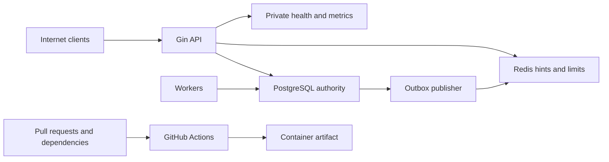

# Security Threat Model

## Executive summary

The highest-risk areas are abuse of temporary holds, authorization across customer-owned resources, JWT replay/type confusion, concurrency-driven inventory corruption, and delivery-chain compromise. PostgreSQL transaction invariants protect booking integrity; Redis, HTTP middleware, workers, monitoring, and CI require explicit failure and trust policies. Hold hoarding across many accounts remains a material Milestone 1 residual risk because durable reservation quotas, anti-bot controls, and identity verification are explicitly deferred.

## Scope and assumptions

In scope: `cmd/`, `internal/`, `migrations/`, `.github/workflows/`, `Dockerfile`, `docker-compose.yml`, and deployment/configuration documentation once implemented. The design evidence is currently the accepted PRD and ADRs.

Assumptions validated from the project contract:

- The API is Internet-facing behind TLS termination and trusted proxies; PostgreSQL, Redis, `/metrics`, and detailed readiness are private.
- Customers may self-register; payment, national identity verification, anti-bot, waiting room, and reservation quotas are absent.
- PostgreSQL credentials and hosts are not already compromised.
- Resource UUIDs are observable and never treated as authorization.
- Passenger display names and travel associations are sensitive, even without document identifiers.
- Planned controls are not credited as implemented until tests and review point to code/config evidence.

Open deployment questions that affect final ranking: TLS/load-balancer ownership, secret/key management and rotation, backup encryption/retention, monitoring-plane access control, and production database network policy.

## System model

### Primary components

- Gin API process for public/customer/admin/operator REST endpoints.
- PostgreSQL primary as seat, reservation, ticket, idempotency, and outbox authority.
- Redis for cache hints, rate limits, and optional Streams publication.
- Hold-expiration and outbox worker processes using shared internal modules.
- Prometheus/health surfaces for operations.
- GitHub Actions and Docker build producing the runtime image.

### Data flows and trust boundaries

- Internet -> Gin API: credentials, JWTs, search values, passenger fields, idempotency keys, and booking commands over HTTPS; enforce body limits, strict decoding, normalization, authentication/RBAC/ownership, rate policies, and safe errors.
- JWT -> application identity: claims cross from an untrusted bearer into authorization; enforce one signing method, type, issuer, audience, time claims, token version, and active user.
- API/workers -> PostgreSQL: authority-critical masks, state, PII, and outbox payloads over a pooled TLS-capable database channel; parameterized SQL, least privilege, explicit transactions, and deterministic locks.
- API -> Redis: cache/limiter keys and non-authoritative values; use timeouts, TLS/credentials where deployed, Lua atomics, bounded TTLs, and endpoint-specific outage policy.
- PostgreSQL outbox -> publisher -> log/Redis Stream: minimized typed envelopes; enforce type/size/schema allowlists, bounded retries, poison isolation, and no payload logging.
- Monitoring client -> health/metrics: operational status and bounded labels; restrict network exposure and omit identifiers/secrets.
- Contributor/dependency -> CI -> image: untrusted code and third-party tooling enter the delivery pipeline; immutable pins, read-only permissions, no PR secrets, scanning, and protected release gates.
- Admin/operator token -> privileged routes: topology/fare/run/inventory mutations; explicit role groups, fresh token version, safe audit metadata, and no customer impersonation.

#### Diagram

## Assets and security objectives

| Asset | Why it matters | Security objective (C/I/A) |
|---|---|---|
| Seat inventory, reservations, run status | Overselling, stale release, or hoarding defeats the core platform | I, A |
| Tickets and ticket orders | Represent travel entitlement and customer travel data | C, I |
| JWT keys, refresh state, password hashes | Compromise permits account/role takeover | C, I |
| Passenger names and ownership links | Customer-isolated personal/travel information | C, I |
| Idempotency records | Prevent duplicate commands and ambiguous retries | I, A |
| Outbox state/payloads | Preserve reliable minimized event delivery | C, I, A |
| Redis limiter/cache state | Abuse resistance and read availability | I, A |
| Logs, errors, health, metrics | Can leak secrets/PII or be cardinality-exhausted | C, A |
| CI credentials, workflow, dependencies, image | Define source and release integrity | C, I |

## Attacker model

### Capabilities

- Remote unauthenticated registration/login/search traffic and arbitrary malformed HTTP input.
- Authenticated customer commands, repeated retries, many guessed/observed UUIDs, and potentially many accounts/source addresses.
- Stolen bearer/refresh token replay within its lifetime.
- Concurrency and timing control across create/confirm/cancel endpoints.
- Malicious pull request or compromised third-party dependency/action, subject to repository protections.

### Non-capabilities

- No assumed direct PostgreSQL/Redis host access, server filesystem access, signing key, admin/operator credential, or trusted CI environment control.
- No payment or national identity system exists to attack.
- Cross-region partitions and consensus failure are outside Milestone 1.

## Entry points and attack surfaces

| Surface | How reached | Trust boundary | Notes | Evidence |
|---|---|---|---|---|
| Auth endpoints | Public HTTP | Internet/API, JWT/application | Credential stuffing, token issuance/refresh | `docs/prd/milestone-1-core-ticketing.md` Identity and access |
| Search/availability | Public HTTP | Internet/API, API/PostgreSQL/Redis | Strict query/sort/pagination; cache is hint | ADR 006 |
| Passenger/reservation/ticket APIs | Bearer HTTP | Internet/API, JWT/application | Ownership/IDOR and lifecycle races | ADRs 004, 009 |
| Admin/operator APIs | Privileged bearer HTTP | JWT/application | RBAC and operational-state integrity | ADR 001 |
| PostgreSQL adapters | API/worker calls | Process/database | Dynamic SQL, locks, authority | ADRs 002, 003, 005 |
| Redis limiter/cache | API calls | Process/Redis | Outage, spoofed source, key abuse | ADR 006 |
| Expiration/outbox workers | Scheduled loops/processes | Worker/database/publisher | Duplicate claims, poison events | ADRs 004, 007 |
| `/livez`, `/readyz`, `/metrics` | Operations HTTP | Monitoring plane | Detail/secret/cardinality exposure | PRD Health and metrics |
| CI and Docker | Push/PR/dependency | Contributor/CI/artifact | Supply-chain execution | PRD CI/container requirements |

## Top abuse paths

1. Create many accounts, distribute source addresses, acquire maximum temporary holds on a hot run, let them expire, and reacquire, denying legitimate availability.
2. Replace a passenger/reservation/order/ticket UUID with another customer's ID; exploit a repository query missing authenticated-owner scope.
3. Replay a refresh token as access, exploit weak algorithm/type/audience checking, or retain an old role after token-version change.
4. Race confirm/cancel/expire or run cancellation/create-hold; exploit inconsistent lock order or stale release to corrupt masks.
5. Flood unique/oversized idempotency keys or ambiguous canonical forms to grow storage or create duplicate semantics.
6. Make Redis unavailable or spoof forwarded source IPs to bypass limits or deny protected commands.
7. Inject unsafe sort fragments or extreme pagination/query values to execute SQL or exhaust the pool.
8. Place sentinel secrets/PII in passenger/error/event input that reaches logs, errors, or high-cardinality labels.
9. Insert or trigger an oversized/unknown outbox event that retries forever, blocks good events, or leaks payloads.
10. Compromise an unpinned action, dependency, tool installer, or base image to execute in CI and alter/exfiltrate artifacts.

## Threat model table

| Threat ID | Threat source | Prerequisites | Threat action | Impact | Impacted assets | Existing controls (evidence) | Gaps | Recommended mitigations | Detection ideas | Likelihood | Impact severity | Priority |
|---|---|---|---|---|---|---|---|---|---|---|---|---|
| TM-001 | Token thief/remote client | Stolen/malformed JWT | Replay or type/algorithm/claim confusion | Account/role takeover | JWT state, reservations, tickets | Planned typed JWT/method/version checks in PRD | Issuer/audience, rotation, family reuse not implemented | Exact method; access/refresh separation; validate `iss/aud/sub/exp/nbf/iat/type/version`; hashed rotating refresh JTI; family revoke on reuse | Auth failure/reuse counters with bounded reasons | medium | high | high |
| TM-002 | Authenticated customer | Observable foreign UUID | Read/mutate another owner's resource | PII leak or booking corruption | Passenger/reservation/ticket data | Ownership invariant in PRD/ADR 009 | No implementation evidence | Scope every query/mutation by resource and authenticated user; count-check mixed passenger sets; uniform not-found | Cross-user negative tests and forbidden counters | medium | high | high |
| TM-003 | Authenticated customer | Many requests/keys | Key flooding, weak-key guessing, fingerprint ambiguity, expiry reuse | Storage DoS or duplicate/conflict errors | Idempotency, reservations | Transactional design in ADR 005 | Size/entropy/retention and quota absent | Bound header, require high entropy, version canonical encoding, include operation/semantics, define retention/reuse, optionally HMAC key hash | Unique-key creation rate/storage alerts | high | medium | high |
| TM-004 | Sybil/automated customers | Cheap account creation | Cycle max-size holds across accounts/IPs | Seat availability denial | Inventory availability | 10-minute TTL, passenger cap, Redis limits | Anti-bot, identity and durable reservation quotas deferred | Per-account/source limits, fail-closed create limiter, bounded TTL/passenger count; document residual risk; Milestone 2 durable quotas/admission | Hot-run hold/expire ratio, per-principal active holds | high | high | high |
| TM-005 | Remote attacker/dependency failure | Redis outage/latency or spoofable proxy | Bypass limits or deny all API work | Credential/hold abuse or outage | Redis state, service availability | Endpoint-policy requirement and ADR 006 | Trusted-proxy/degraded readiness not implemented | Short timeouts; protected new writes fail closed; safe PostgreSQL reads and confirm/cancel degrade independently; configured trusted proxies; account+source Lua keys | Redis failure and fail-closed counters | high | medium | high |
| TM-006 | Remote input/internal error | Input reaches diagnostics | Leak password/token/key/PII/payload or explode labels | Confidentiality/monitoring DoS | Secrets, PII, monitoring | ADRs 007/009 and PRD bounded labels | No logger/metric tests yet | Allowlist structured metadata; no bodies/headers/full payloads; normalized routes; bounded enums; private metrics/readiness | Sentinel leakage and bounded-series tests | medium | high | high |
| TM-007 | Public search client | Dynamic sort/query path | SQL injection or resource-exhausting query | Data compromise or DB outage | PostgreSQL, service | PRD sort allowlist/pagination | No adapter evidence | Closed sort enum to constant fragments; parameterize values; max page; timeouts; indexed plans; least-privilege runtime DB role | Invalid-sort/fuzz tests, slow-query metrics | medium | high | high |
| TM-008 | Concurrent customer/operator/worker | Racy commands | Stale/double release or hold after cancellation | Inventory corruption/oversell | Inventory, reservations, tickets | ADRs 002/004 and reconciliation design | No executable lock/release tests | Lock authoritative state before check; one order; database deadline after lock; exact row/subset checks; unique ticket constraints; reconciliation | Barrier-driven repeated race tests | medium | high | high |
| TM-009 | Internal defect/privileged writer | Invalid event row | Poison retry loop or payload leak | Event backlog/leak | Outbox, logs, consumers | ADR 007 bounded state/types | Schema/size enforcement unimplemented | Version/type/size constraints; isolate per item; bounded retries; metadata-only logs; durable consumer dedupe | Poison-event integration suite/backlog age | medium | medium | medium |
| TM-010 | Malicious PR/compromised upstream | CI runs third-party code | Exfiltrate token/secrets or alter image | Release compromise | CI, source, artifact | Planned read-only/scanner gates | Workflow/actions/image not implemented | Pin actions and bases by digest/SHA; no `pull_request_target`; no PR secrets; protected publish; pinned tools; SBOM/provenance | Actionlint/policy/Gitleaks/Trivy and fork-PR dry run | medium | high | high |

## Criticality calibration

- **Critical**: unauthenticated remote code execution in the API/image; direct auth bypass to admin/operator; deterministic widespread overselling from a public request.
- **High**: cross-customer reservation/ticket access; signing-key or CI artifact compromise; repeatable inventory corruption; practical hot-run denial.
- **Medium**: bounded targeted denial, isolated poison event, partial low-sensitivity disclosure, or abuse requiring a privileged/internal precondition.
- **Low**: low-sensitivity metadata leak, noisy easily rate-limited traffic, or a weakness requiring direct trusted-host control with minimal additional impact.

## Focus paths for security review

| Path | Why it matters | Related Threat IDs |
|---|---|---|
| `internal/accounts/**` | Password, JWT, refresh rotation, roles, passenger ownership | TM-001, TM-002 |
| `internal/booking/**` | Allocation, releases, lifecycle, idempotency, ownership | TM-002, TM-003, TM-004, TM-008 |
| `internal/offering/**` | Train-run commissioning/status and safe query inputs | TM-007, TM-008 |
| `internal/query/**` | Sort allowlist, pagination, cache hints | TM-005, TM-007 |
| `internal/eventrelay/**` | Poison isolation, payload handling, claims/finalize | TM-006, TM-009 |
| `internal/platform/middleware/**` | Proxy trust, request limits, auth, logs, errors | TM-001, TM-005, TM-006 |
| `internal/platform/metrics/**` | Bounded labels and private exposure | TM-006 |
| `migrations/**` | Constraints, least privilege, status/type/size guards | TM-002, TM-003, TM-008, TM-009 |
| `.github/workflows/**` | Permissions, immutable actions, untrusted PR execution | TM-010 |
| `Dockerfile` and `Makefile` | Base/tool pins and artifact hardening | TM-010 |

## Notes on use

- This is a pre-implementation model; rerun it against code, migrations, CI, and containers before PR approval.
- Every entry point and trust boundary above must have at least one implementation test or review anchor.
- Runtime, CI/dev, and test-only controls must remain clearly separated.
- The explicit non-goals do not erase residual risk. In particular, TM-004 cannot be reported as fully mitigated until a later milestone adds durable quotas/admission or equivalent evidence.
