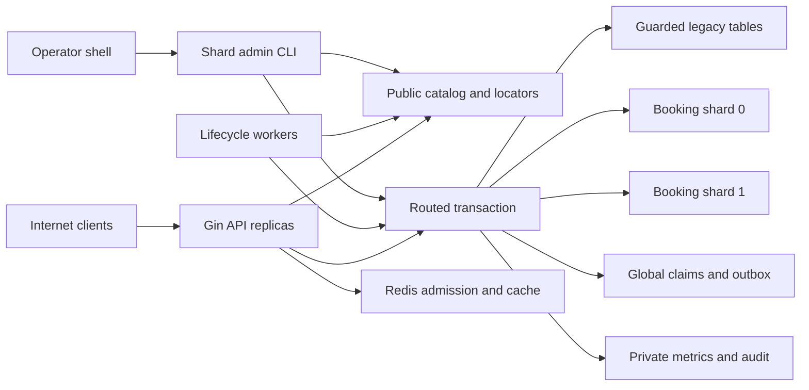

# Scalable Railway Ticketing Platform: Milestone 4 Threat Model

## Executive summary

Milestone 4 adds fixed, schema-isolated logical booking shards inside one PostgreSQL cluster. The dominant risks are stale-writer races, unsafe identifier handling, and migration or rollback operations that could discard committed booking state.

The work-in-progress branch contains Migration 8, runtime code, focused tests,
and operator tooling. These controls are not accepted until final controlled
runtime, CI, independent security review, and release evidence pass.

## Evidence status

This threat model originated as a pre-implementation baseline. Table entries
that say a Milestone 4 control did not exist describe that baseline, not the
current source inventory. Treat them as acceptance requirements and historical
gap context.

Current implementation is present but final runtime, CI, independent review,
and release acceptance remain pending. Redis, route caches, and public inputs
remain non-authoritative.

## Scope and assumptions

In scope:

- Runtime code under `cmd/` and `internal/` that routes, reads, or mutates booking state.
- PostgreSQL migrations and schema boundaries under `migrations/`.
- The `cmd/shard-admin` command, shard-aware lifecycle workers, reconciliation, metrics, and readiness behavior.
- The logical legacy, `booking_shard_0`, and `booking_shard_1` storage targets in one PostgreSQL cluster.
- Existing Redis admission and read-cache interactions when assignment or migration state changes.
- CI and deployment configuration only where it affects secret exposure, database privilege, or operational-surface reachability.

Out of scope:

- Physical PostgreSQL shards, independent database failure domains, cross-database transactions, and transparent online rebalancing.
- Multi-region or active-active writes, payment, Kafka, service mesh, Kubernetes operators, and Milestone 5.
- A compromised PostgreSQL superuser, host administrator, or trusted release environment; those actors already control the authoritative database or artifact.

Assumptions materially affecting priority:

- The API is Internet-facing, while PostgreSQL, Redis, worker health, metrics, and `shard-admin` are private operational surfaces.
- Customers can control train-run, reservation, ticket-order, ticket, passenger, pagination, and idempotency inputs, but no public request can choose a shard, schema, assignment generation, or migration.
- The topology is fixed to `legacy`, `shard-0`, and `shard-1`; arbitrary catalog rows or environment strings are not trusted as SQL identifiers.
- Redis may be stale, unavailable, restored, or actively modified, but it cannot authorize a PostgreSQL booking write.
- PostgreSQL remains one transaction domain. The minimal global idempotency-key claim, global quota claims, public locators, central outbox, and shard-local booking state can therefore commit atomically.
- The current work-in-progress branch contains fencing, locators, fixed schema handles, migration state, and retained-public guards. Their final runtime, CI, review, and release acceptance is pending.

Open deployment questions that can change likelihood are whether API and `shard-admin` use separate least-privilege database roles, how operator identity is established for CLI audit, whether schema `CREATE` is revoked from runtime roles, and how private health/metrics/CLI access is enforced.

## System model

### Primary components

- Three stateless Gin API replicas accepting public, customer, admin, and operator HTTP traffic.
- A catalog/router deep module that resolves a train run or locator to one fixed `ShardHandle` and optional bounded route-cache entry.
- A routed-transaction module that starts a PostgreSQL transaction, applies only an allowlisted transaction-local schema selection, locks assignment and fence state, and exposes booking repositories only after validation.
- Public control/global tables for shard catalog, assignments, migrations, minimal idempotency-key claims, cross-shard quota claims, reservation/order/ticket locators, migration audit, and the central same-database outbox.
- Retained public booking tables serving only `legacy` assignments, protected by database guards against routed-write bypass after reassignment.
- Two fixed shard schemas containing authoritative train-run booking state, local completion idempotency, and write fences.
- PostgreSQL migration coordination for plan, drain, quiesce, copy, validate, cutover, rollback window, reverse migration, and explicit cleanup.
- Redis waiting-room/admission state and disposable read caches; neither is an ownership authority.
- Hold-expirer, central outbox worker, admission worker, read-model worker, and detect-only reconciliation processes operating on bounded worksets.
- Private `shard-admin` CLI for inspection and explicitly confirmed migration, cutover, rollback, and cleanup operations.
- Prometheus-compatible health and metrics surfaces with bounded labels.

### Data flows and trust boundaries

- Internet client -> Gin API: credentials, JWTs, train-run/resource UUIDs, idempotency keys, passenger fields, and admission tokens cross over HTTP/TLS termination. Existing request parsing, JWT validation, current-database role checks, owner-scoped SQL, size limits, rate limits, and safe errors remain applicable. Shard, schema, generation, and migration fields are rejected if supplied.
- API/worker -> public catalog: a train-run or locator lookup returns an expected fixed shard ID and generation. The result may be cached briefly, but it is not write authority and cannot select an arbitrary schema.
- Router -> routed transaction -> selected storage: only an internally constructed `ShardHandle` can select storage. The transaction locks the current assignment and corresponding fence before any idempotency claim, quota mutation, inventory update, locator write, or outbox append.
- Routed transaction -> public and shard-local tables: the minimal global key claim is inserted only after route/fence validation and stores no completed replay result; local idempotency remains with authoritative booking state. Global quota claims, locators, central outbox intent, and local booking state commit or roll back in the same PostgreSQL transaction.
- Old or bypassing writer -> retained public booking tables: database guards independently reject a train-run write unless the locked assignment still authorizes `legacy` at the expected generation. Application routing alone is not credited as the control.
- API -> public locator -> selected storage: reservation, ticket-order, and ticket identifiers resolve exactly one route. Locator owner metadata is an index hint, not final authorization; the selected authoritative row must still match the authenticated owner and current assignment.
- Operator shell -> `shard-admin` -> catalog/source/target: privileged, operator-controlled commands receive bounded canonical identifiers, use dry-run where meaningful, require migration-bound confirmation for mutations, honor cancellation/timeouts, and write a sanitized audit outcome.
- Migration coordinator -> source/target/control tables: copy is deterministic and bounded. Cutover locks assignment and both fences, enforces a configured locator-row cap and statement timeout, then changes assignment, locators, fences, availability generation, and rollback state atomically.
- Normal target mutation/rollback -> target-write evidence: every successful target mutation and any direct rollback take conflicting assignment/fence locks. Target-write evidence is recorded within the mutation transaction, so rollback cannot race a first target write after checking for zero writes.
- API/admission worker -> Redis: admission tokens bind train run and request identity, not shard. A migration or stale-route rejection must release/recover the processing lease without permanently consuming the token or completing booking idempotency.
- Public availability read -> route -> authoritative storage -> Redis cache: availability includes assignment generation in its internal cache envelope/namespace. Cutover rotates the affected namespace; booking never trusts cached availability.
- Worker/admin fanout -> fixed storage workset: enumeration is allowlisted and
  capped, with per-shard/global deadlines, bounded memory, cancellation, and
  explicit partial results. The current admin reconciliation traversal is
  deterministic and serial, with effective concurrency `1`.
- Runtime -> logs/metrics/health: only bounded result categories and allowlisted shard aliases cross into observability. Schema names, generations, resource IDs, migration IDs, DSNs, SQL, secrets, and PII do not.

#### Diagram

## Assets and security objectives

| Asset | Why it matters | Security objective (C/I/A) |
|---|---|---|
| Shard catalog and fixed ID-to-schema mapping | Selects the only storage candidates and prevents metadata from becoming SQL syntax | I, A |
| Train-run assignment and monotonic generation | Identifies the current owner; corruption can create a stale or conflicting writer | I, A |
| Per-storage train-run fences and retained-public database guards | Enforce single-writer authority even when an API replica or old code path is stale | I, A |
| Seat inventory and segment masks | Overlap or lost updates can oversell travel inventory | I, A |
| Reservations, reservation seats, orders, and tickets | Represent booking state, travel entitlement, and customer travel associations | C, I, A |
| Minimal global idempotency-key claims and local completion records | Preserve global conflict semantics and durable replay without allowing a wrong shard to claim success | I, A |
| Global quota claims | Prevent users or passengers bypassing limits by spreading holds across logical shards | I, A |
| Reservation, order, and ticket locators | Avoid scans while preserving route correctness and owner isolation | C, I, A |
| Central same-database outbox | Preserves atomic event intent and at-least-once publication across all storage targets | C, I, A |
| Migration state, validation report, cursor, and audit | Determine whether copy, cutover, rollback, or cleanup is safe and resumable | I, A |
| Durable target-write evidence | Prevents direct rollback from discarding committed target mutations | I, A |
| Retained source copy and rollback window | Provide bounded recovery evidence without becoming a second writer | C, I, A |
| Admission tokens and processing leases | Migration handling must not consume customer authorization or leak capacity | C, I, A |
| Availability namespace and projection | Stale data may mislead customers or load the database but must not authorize booking | I, A |
| Database/Redis credentials and topology | Disclosure enables dependency access or materially aids targeted denial | C, I |
| Logs, audit, health, and metrics | Must support detection without leaking PII, secrets, identifiers, or creating cardinality denial | C, I, A |

## Attacker model

### Capabilities

- A remote unauthenticated client can send malformed, repeated, and concurrent public HTTP requests and can observe public train-run identifiers.
- An authenticated customer can choose owned and guessed reservation/ticket identifiers, idempotency keys, passenger sets, admission tokens, request timing, and retry patterns across different API replicas.
- An attacker can exploit stale per-replica route caches, connection resets, timeouts, and high concurrency around drain or cutover, but cannot directly choose which side of an ambiguous PostgreSQL commit succeeded.
- A stolen customer bearer token permits that customer's operations during its valid lifetime; a stolen operator JWT is modeled for existing privileged HTTP routes.
- A compromised or corrupted Redis instance can return stale/malicious cache and admission state, delete state, or deny requests.
- A malicious or mistaken operator with CLI execution and its database credential can replay, race, or misuse migration commands; this privileged misuse is modeled because cutover and cleanup are high-impact.
- A malicious pull request or dependency can attempt to weaken identifier validation, guards, tests, or artifact integrity, subject to existing CI controls.

### Non-capabilities

- A normal customer cannot directly connect to PostgreSQL, create schemas, edit the shard catalog, execute `shard-admin`, or supply a schema identifier through a supported API.
- Redis compromise alone does not grant PostgreSQL assignment, fence, inventory, locator, or outbox write authority.
- A stale API route does not imply authority once the planned transaction lock and database guard controls are implemented.
- Separate physical database outages, cross-region partitions, distributed transaction failures, and consensus attacks are outside this logical same-cluster milestone.
- PostgreSQL superuser or trusted host compromise is not separately ranked because it already gives control over all authoritative state.

## Entry points and attack surfaces

| Surface | How reached | Trust boundary | Notes | Evidence (repo path / symbol) |
|---|---|---|---|---|
| Reservation create | Customer bearer HTTP with train run, passengers, idempotency key, optional admission token | Internet/API, API/router, router/PostgreSQL | Must route before any global/local idempotency side effect and fence before mutation | `internal/app/reservation.go::CreateHold`, `internal/booking/postgres/reservation_store.go::CreateHold` |
| Reservation get/confirm/cancel | Customer bearer HTTP with reservation UUID | Internet/API, API/locator, locator/shard | Must not scan; locator cannot replace authoritative owner check | `internal/app/reservation.go::{GetReservation,ConfirmReservation,CancelReservation}`, `internal/app/postgres_reads.go::GetReservationDetail` |
| Ticket/order reads and owner list | Customer bearer HTTP with resource UUID or bounded page | Internet/API, API/locator, bounded route grouping | Owner page begins from global locator index and must not silently return partial data | `internal/app/tickets.go`, `internal/app/postgres_reads.go` |
| Routed transaction and schema selection | Internal route result from catalog/cache | Router/DB connection pool | Identifiers cannot be query parameters; allowlist and transaction-local reset are security-critical | `docs/prd/milestone-4-train-run-sharding.md`, `docs/adr/028-shard-catalog-and-routing.md` |
| Retained public booking tables | Old store, operator code, or missed mutation path | Process/PostgreSQL | Must have database guards because current baseline writes public tables directly | `internal/booking/postgres/store.go`, `internal/booking/postgres/reservation_store.go` |
| Assignment/fence/catalog | Routed writes, workers, and admin CLI | Process/public control schema | Lock ordering and privilege separation determine whether stale writers or tampering succeed | `docs/adr/018-future-train-run-shard-ownership.md`, `docs/adr/029-single-writer-fencing-generation.md` |
| Minimal global idempotency claim | Every booking operation after route/fence validation | Shard transaction/public control schema | Must preserve cross-shard key conflict but contain no replay result or routing authority | `docs/prd/milestone-4-train-run-sharding.md`; current local behavior: `internal/booking/postgres/idempotency.go` |
| Central outbox | Booking transaction and central outbox worker | Shard transaction/public table, worker/publisher | Same-database insert remains atomic; no migration copy or shard probing is needed | Current implementation: `internal/booking/postgres/outbox.go`, `internal/eventrelay/postgres/store.go` |
| Migration/cutover/rollback/cleanup | Private operator CLI | Operator/process/database | Highest-impact privileged surface; requires state, generation, cap, lock, audit, and confirmation controls | Planned `cmd/shard-admin`; existing bounded patterns: `cmd/read-model-admin/main.go`, `cmd/reconcile/main.go` |
| Hold expiration and reconciliation | Periodic private processes | Worker/catalog/shards | Must use bounded fair worksets and the same fencing boundary as API writes | `cmd/hold-expirer/main.go`, `internal/booking/postgres/reservation_store.go::ExpireDue`, `cmd/reconcile/main.go` |
| Admission token lifecycle | Redis-backed token use followed by booking | API/Redis, API/PostgreSQL | Migration rejection must be non-permanent; ambiguous commits use durable replay | `internal/app/reservation.go::createHotHold`, `internal/admission/redis/finalize_committed.go` |
| Availability/read cache | Public query through Redis and PostgreSQL | Internet/API/cache, API/router/shard | Generation-aware hint only; never allocation authority | `internal/query/cache`, `docs/availability-cache.md` |
| JWT authorization | Bearer token on customer/admin/operator routes | Internet/JWT/application/PostgreSQL | Existing parser reloads current active state, role, and token version | `internal/accounts/application/jwt.go::parseToken`, `internal/accounts/postgres/store.go::AuthenticationState` |
| Health, metrics, logs, and errors | Operations endpoints and process output | Runtime/monitoring | Topology, SQL, IDs, DSNs, and unbounded labels must remain private/sanitized | `internal/platform/metrics`, `internal/platform/safeerror/database.go`, `internal/transport/httpapi/router.go` |
| CI and container build | Push, pull request, dependency update | Contributor/CI/artifact | A change can remove a guard or test and create a release-wide correctness flaw | `.github/workflows/`, `Dockerfile` |

## Top abuse paths

1. A client sends concurrent create requests to replicas caching the source generation; a weak check reads assignment without a conflicting lock, cutover commits, and the old transaction then updates retained public inventory, creating two accepted writers and possible overlapping seats.
2. An unsafe catalog/config/HTTP value becomes a schema identifier or session-level `search_path`; pooled connections retain it and later customer work reads or mutates another schema.
3. Old code bypasses the routed transaction and writes retained public booking tables after a run moves to `shard-0`; without a database guard, application-layer fencing is silently defeated.
4. A stale route inserts a global idempotency claim before fence validation, then fails; a correct retry on the target conflicts with the orphan claim, or a wrong-shard local record is treated as a completed replay.
5. Locator corruption redirects a guessed reservation/order/ticket ID; if locator owner metadata is trusted as authorization, the attacker reads or mutates another customer's authoritative row.
6. An operator replays or races `cutover` against stale validation, exceeds the locator update budget, or cancels mid-operation; a non-atomic implementation exposes a partially switched assignment/locator set.
7. An operator starts direct rollback after observing zero target writes while a first target mutation concurrently commits; without conflicting locks and transactionally recorded evidence, rollback discards that committed state.
8. A premature or replayed cleanup deletes retained source rows before the rollback window or against a current assignment, removing recovery evidence or live data.
9. A customer or operator triggers unbounded locator grouping or shard fanout; one locked/unavailable schema consumes every pool connection and starves otherwise healthy routes and booking traffic.
10. Compromised Redis returns a stale route/cache hint or migration-time admission state; code trusts it for ownership or permanently consumes a token after a fenced rejection, causing correctness failure or targeted denial.
11. Internal shard, schema, generation, migration, SQL, or DSN details enter public errors, logs, or metric labels, enabling topology discovery, credential leakage, or high-cardinality monitoring denial.

## Threat model table

| Threat ID | Threat source | Prerequisites | Threat action | Impact | Impacted assets | Pre-implementation controls (baseline) | Pre-implementation gaps | Required/current mitigation | Detection ideas | Likelihood | Impact severity | Priority |
|---|---|---|---|---|---|---|---|---|---|---|---|---|
| TM-025 | Remote client, corrupted catalog, or unsafe configuration | Any attacker-controlled or merely unvalidated value can influence a schema identifier or connection `search_path` | Select another schema, introduce an identifier payload, or leak a previous transaction's path through the pool | Cross-schema read/write, owner bypass, or booking corruption | Schema mapping, booking/PII, DB availability | Current production booking SQL is static; tests use `pgx.Identifier.Sanitize` for isolated schemas | No M4 allowlist/handle/reset evidence exists; identifier quoting alone would still allow unauthorized valid schemas | Fixed enum-to-schema map; reject every row/config outside it; prefer prebuilt qualified SQL. If `search_path` is used, set it locally only after validation and test commit, rollback, error, cancellation, and pool reuse. Revoke runtime schema creation | Identifier-rejection counters with bounded reasons; startup topology validation; pooled reset integration tests | medium | high | high |
| TM-026 | Concurrent customer or stale API/worker replica | Route validation does not hold a lock conflicting with cutover, or a mutation path omits the guard | Commit a source write after assignment changes to target | Split-brain inventory, duplicate reservation, overlapping allocation | Assignment, fences, inventory, reservations, tickets | ADR 018 already requires a PostgreSQL fenced generation; current allocation uses row locks and atomic predicates | Current Read Committed booking transactions have no assignment/fence lock | Lock assignment then selected fence before any side effect and hold through commit; cutover takes conflicting locks on assignment and both fences; all public/shard tables enforce DB guards; one authoritative refresh/retry only | Stale/fence rejection metrics; reconciliation for dual writable fences, duplicate reservation, mask mismatch; deterministic three-replica/100-request barrier tests | high | high | critical |
| TM-027 | Compromised application path, unsafe operator, or over-privileged DB role | API/worker credential can mutate catalog/migration rows or bypass a guarded interface | Install a malicious shard ID, decrease generation, enable two fences, or reassign without migration | Persistent ownership takeover or denial | Catalog, assignment, fences, all booking state | Existing JWT validation checks current DB role for HTTP operations | Repository migrations do not yet evidence role separation or M4 constraints; CLI identity model is undecided | Separate runtime and shard-admin DB roles; no DDL/catalog mutation for API. DB checks/unique constraints and guarded transition functions enforce fixed IDs, positive monotonic generation, one assignment, one active migration, and at most one writer | Audit all assignment/fence transitions using trusted DB identity; alert on invalid transition or generation mismatch | medium | high | high |
| TM-028 | Authenticated customer plus locator corruption or implementation defect | Customer knows a resource UUID and code accepts locator owner/route without authoritative revalidation | Route to a foreign resource or wrong generation and read/mutate it | Cross-customer data exposure, booking corruption, or targeted denial | Locators, PII, reservations, tickets | Existing reads and mutations scope authoritative rows by user; UUIDs are not treated as authorization | Public locators do not yet exist; dynamic cross-schema FK cannot alone prove resource ownership | Create/update resource and locator atomically; validate locator against current assignment; recheck `user_id` in authoritative resource; missing locator never scans; reconcile duplicates and stale generations | Locator mismatch/not-found counters without IDs; detect-only locator/resource/owner reconciliation | low | high | medium, becoming high if locator metadata is used for authorization |
| TM-029 | Concurrent client or implementation defect | Global idempotency claim is acquired before route/fence validation, carries replay authority, or commits apart from local state | Strand a cross-shard key claim, create conflicting local results, or replay from the wrong shard | Retry denial, duplicate booking, or false durable result | Global key claims, local idempotency, reservation state | Current local idempotency is transactionally completed with booking; same key/different request conflicts | It currently assumes one public table; no minimal cross-shard claim exists | After route/fence lock, atomically insert a minimal global key/fingerprint claim, acquire/complete local idempotency, mutate booking/quota/locator, append outbox, and commit. Global claim stores no completed response and cannot route/replay. Stale/migration rejection rolls it back | Cross-shard conflict/replay tests; reconciliation that every claim maps to one local record and valid resource without logging key material | medium | high | high |
| TM-030 | Old application path, worker, migration tool, or SQL defect | Retained public tables remain writable without checking current assignment/generation | Mutate legacy reservations, inventory, idempotency, or tickets after the run moved | Hidden second writer and divergence from locator/target | Retained public booking state, assignment, inventory | Existing code centralizes most customer writes in `booking/postgres.Store`, but several workers/operator seams exist | Application encapsulation alone cannot stop old binaries or missed SQL paths | Add database guards/triggers or guarded routines on every retained public train-run mutation. They lock/verify `legacy` assignment and expected generation; migration copy uses an explicit constrained mode rather than disabling guards globally | Count guard rejections by bounded operation/reason; stale-source reconciliation; regression that direct legacy SQL fails after cutover | medium | high | high |
| TM-031 | Malicious/mistaken operator or interrupted process | Migration commands lack authorization, state CAS, bounded validation, or locator cap | Replay a phase, cut over partial data, update too many locators, or expose partial mapping | Data loss, prolonged lock outage, or inconsistent routing | Migration state, assignment, locators, source/target data | Existing read-model admin/reconcile CLIs use canonical UUIDs, dry-run/apply, timeouts, bounded batches, and safe errors | No shard-admin, operator audit, migration state machine, or cutover cap exists | Private CLI and separate role; one active migration; state/generation compare-and-set under locks; deterministic validation; preflight configured locator count cap and supporting index; one bounded statement timeout; assignment/fences/all affected locators/availability generation commit atomically | Audit command/state/result using trusted identity; migration duration, validation failure, locator count/cap, lock timeout, cancellation metrics | medium | high | high |
| TM-032 | Concurrent customer and operator | Direct rollback checks target-write evidence without locks that conflict with normal target mutations | First target mutation commits after zero-write check; rollback then restores stale source | Silent loss of committed reservation/ticket/outbox state | Target-write evidence, source/target data, assignment, locators | ADR 018 rejects unsafe handoff; current system has no post-cutover rollback | No durable target-write marker or atomic rollback lock protocol exists | Every successful target mutation records evidence in its transaction while holding assignment/fence locks. Direct rollback locks assignment and both fences in the conflicting order, then checks evidence and locators. Any evidence permanently requires reverse migration with newer generation | Target-write evidence reconciliation; rejected direct-rollback metric; race test with deterministic first target commit | medium | high | high |
| TM-033 | Malicious/mistaken operator | Cleanup can be automatic, uses client time, accepts generic confirmation, or does not revalidate authority | Delete retained source before expiry or delete current data | Loss of recovery evidence or live booking state | Retained source, rollback window, audit | Existing admin commands default to dry-run for meaningful mutations | M4 cleanup command and DB gate are absent | Separate cleanup command only; database time; completed migration plus expired window; current assignment/fences and validation rechecked under locks; explicit confirmation bound to migration/source/generation; no `CASCADE`; bounded cancellable deletion and no automatic trigger | Cleanup audit, rows-selected/deleted bounds, interrupted-cleanup tests, alert on cleanup against nonterminal migration | low | high | medium |
| TM-034 | Public client, operator input, or one degraded shard | Customer path scans, owner page groups unbounded routes, or worker/admin fanout lacks deadlines/fairness | Exhaust memory, goroutines, or PostgreSQL connections and starve healthy routes | Booking/read outage and misleading partial data | Pool capacity, worker progress, API availability | Existing expiration/outbox/reconcile paths use batch limits, timeouts, `SKIP LOCKED`, and poison-item isolation | They are not yet shard-aware; no shared bounded workset/fanout module exists | Customer ID reads use one locator. Owner list pages locator index first. Fixed allowlist, bounded concurrency/memory/page, per-shard and global deadlines, stable cursor/order, fair round robin, cancellation, and explicit `complete/partial/unavailable` | Fanout duration/partial/unavailable counters; pool saturation and per-route progress alerts; locked-shard tests | medium | medium | medium |
| TM-035 | Redis writer, dependency failure, or concurrent customer | Application trusts Redis/cache for assignment, or classifies stale/migrating booking failure as permanent after acquiring admission | Route incorrectly, trust stale availability, consume token, leak inflight/quota, or duplicate on retry | Integrity failure if authority is trusted; otherwise bounded booking denial | Admission tokens, leases, cache, quota, booking availability | Current hot-booking flow binds token/request, uses processing leases, replay-first durable lookup, non-permanent release for transient errors, and post-commit finalize repair; booking ignores cached availability | New shard/migration error categories and generation-aware cache behavior are unimplemented | Resolve route from PostgreSQL/catalog path; fence every write; treat stale/migrating/fenced/unavailable as retryable and non-permanent; ambiguous commit checks durable local replay before release/finalize. Rotate per-run availability generation at cutover; ignore Redis route hints | Admission release/finalize/inflight metrics, old-cache-generation rejects, Redis-loss and token-before-cutover tests | medium | medium to high | medium |
| TM-036 | Remote client, compromised operator token, or observability integration | Migration capability is exposed over HTTP, stale JWT role is trusted, or raw topology reaches errors/labels/logs | Invoke privileged state change, enumerate topology, leak DSN/SQL/PII, or create cardinality denial | Ownership compromise, credential/data exposure, monitoring outage | Operator authority, credentials, topology, PII, monitoring | `JWTService.parseToken` reloads active, role, and token version from PostgreSQL; safe database errors and finite metric normalization already exist | CLI OS/DB authorization and M4 labels/errors are not implemented | Never expose migration HTTP routes; retain current DB-backed role checks for existing operator APIs; private CLI with least privilege. Public error is generic; allowlist shard aliases and bounded reasons; never emit schema, generation, migration/resource IDs, SQL, DSN, key/token, payload, or PII | Authorization-denial and bounded error metrics; sentinel leakage/cardinality tests; deployment checks for private CLI/metrics | low | high | medium |
| TM-037 | Internal defect or over-privileged publisher | Central outbox append is separable from booking, migration copies/duplicates it, or arbitrary shard provenance controls consumers | Lose an event, publish conflicting duplicates, or make consumers depend on topology | Projection drift, duplicate effects, or operational backlog | Central outbox, read model, audit | Existing booking outbox append uses the booking transaction; central worker claims bounded rows with `SKIP LOCKED` and at-least-once behavior | Routed cross-schema transaction and provenance constraints are unimplemented | Keep one `public.outbox_events` table in the same DB transaction; do not copy it during migration. Use globally unique IDs, allowlisted event types and bounded optional provenance; consumers remain topology-independent and idempotent. Restrict direct outbox inserts to guarded booking/offer paths | Outbox/reconciliation counts by bounded type/result; migration validation of expected intent; duplicate/delayed publisher tests | low | high | medium |

## Criticality calibration

- **Critical:** a public/concurrent path can deterministically permit source and target writes for the same train run, cause widespread overlapping seat allocation, or grant unauthenticated control of assignment/cutover. Examples: a fence check with a cutover TOCTOU; database guards absent on a reachable retained-public mutation path; public migration execution that can enable two owners.
- **High:** exploitation can lose committed booking/ticket data, cross customer ownership, inject or select another schema, or persistently corrupt assignment while requiring authentication, an implementation flaw, or an over-privileged operational credential. Examples: unsafe direct rollback after target writes; locator owner trusted without authoritative verification; catalog mutation available to the API database role.
- **Medium:** exploitation causes bounded denial, operational partial failure, recoverable migration interruption, token/inflight loss, topology exposure, or requires private Redis/operator access without independently defeating PostgreSQL authority. Examples: one shard starving an unbounded fanout; permanently consuming an admission token on a fenced rejection; exposing allowlisted shard aliases but no credentials.
- **Low:** low-sensitivity metadata exposure or noisy invalid input that fails before database access and is cheaply bounded. Examples: a rejected unknown shard alias in private CLI output; a malformed opaque cursor that produces a generic validation error; repeated stale cache entries that only cause a bounded authoritative refresh.

The most important ranking assumptions are that `shard-admin` and dependency endpoints remain private, the runtime PostgreSQL role is not a superuser, and every planned database guard is actually installed and cannot be disabled by ordinary API/worker credentials. If any assumption is false, TM-027, TM-031, TM-033, or TM-036 rises to critical.

## Focus paths for security review

| Path | Why it matters | Related Threat IDs |
|---|---|---|
| `internal/booking/postgres/` | Every create, confirm, cancel, expiration, quota, idempotency, inventory, locator, and outbox operation must enter one fenced routed transaction | TM-026, TM-029, TM-030, TM-032, TM-037 |
| `internal/app/reservation.go` | Owns admission acquire/release/finalize, stale-route retry, ambiguous commit, and public error mapping | TM-026, TM-029, TM-035, TM-036 |
| `internal/app/postgres_reads.go` and `internal/app/tickets.go` | Current owner-scoped reads must become locator-routed without trusting locator ownership or scanning | TM-028, TM-034 |
| Planned catalog/router and routed-transaction packages | Centralize fixed handles, route caching, transaction-local schema selection, lock order, fence validation, and stale refresh | TM-025, TM-026, TM-027 |
| Planned locator package | Controls atomic resource-to-route indexes, cutover updates, owner paging, and bounded route grouping | TM-028, TM-031, TM-034 |
| Planned migration coordinator | Owns the state machine, copy cursor, validation, cutover cap, target-write evidence, rollback locks, and cleanup gate | TM-031, TM-032, TM-033 |
| Planned `cmd/shard-admin/` | Privileged operator input, authorization, confirmation, audit, cancellation, and safe bounded output | TM-027, TM-031, TM-032, TM-033, TM-036 |
| `migrations/000008*` or the next migration-8 files | Must encode fixed schemas, constraints, DB guards, indexes, assignments, locators, claims, audit, and rollback invariants | TM-025 through TM-033, TM-037 |
| `internal/eventrelay/` and `internal/booking/postgres/outbox.go` | Central same-DB outbox atomicity, claims, poison isolation, and topology-independent events | TM-029, TM-037 |
| `internal/admission/` | Redis compromise, processing-lease recovery, and token behavior across drain/fence/cutover | TM-035 |
| `internal/query/cache/` and `internal/query/readmodel/` | Assignment-generation namespace, source reload, and assurance that cached availability remains non-authoritative | TM-035 |
| `cmd/hold-expirer/`, `cmd/outbox-worker/`, `cmd/read-model-worker/`, and `cmd/reconcile/` | Bounded shard worksets, fair progress, fence validation, partial failure, and detect-only defaults | TM-026, TM-030, TM-034, TM-037 |
| `internal/accounts/application/jwt.go` and `internal/accounts/postgres/store.go` | Existing current-database role/token-version control must remain on privileged HTTP paths | TM-036 |
| `internal/platform/config/` | Fixed shard mode/IDs, caps, timeouts, production opt-in, and no unsafe identifier or secret logging | TM-025, TM-027, TM-031, TM-034, TM-036 |
| `internal/platform/metrics/` and `internal/platform/safeerror/` | M4 labels and errors must be finite, sanitized, and topology-free | TM-034, TM-036 |
| `.github/workflows/`, `Dockerfile`, and deployment manifests | Guard tests, scans, role/secret mounts, private operational surfaces, and schema-PoC opt-in are release controls | TM-027, TM-036 |

## Quality check

- Covered public reservation/ticket/read entry points, private workers, operator CLI, PostgreSQL catalog/global/shard boundaries, Redis admission/cache, observability, and CI/artifact surfaces.
- Represented each trust boundary in at least one concrete abuse path and threat.
- Distinguished existing controls with current code evidence from planned Milestone 4 controls in the PRD/ADRs.
- Kept runtime behavior separate from deployment assumptions and CI/build risks.
- Explicitly modeled fixed logical schemas rather than physical shards or cross-database guarantees.
- Included the corrected minimal post-routing global idempotency claim, central same-database outbox, retained-public database guards, conflicting target-write/rollback locks, and bounded locator cutover.
- Remaining open questions are limited to deployment-owned database role separation, operator identity/audit provenance, schema privileges, and private network exposure.
